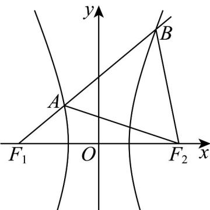

> [!faq]- 《专题11_双曲线标准方程及其性质全方位总结_十大题型__高效培优期中专》官方解析
>
> > [!success]- **【答案】** $\sqrt{7}$
>
> > [!note]- **【分析】**
> > 根据双曲线的定义算出 $\triangle AF_1F_2$ 中， $|AF_1| = 2a$ ， $|AF_2| = 4a$ ，由 $\triangle ABF_2$ 是等边三角形得 $\angle F_1AF_2 = 120^\circ$ ，利用余弦定理算出 $c = \sqrt{7} a$ ，结合双曲线离心率公式即可算出双曲线的离心率·
>
> > [!note]- **【解析】**
> > 根据双曲线的定义，可得 $\left|BF_{1}\right|-\left|BF_{2}\right|=2a$
> >
> > 因为 $\triangle ABF_{2}$ 是等边三角形，即 $|BF_{2}| = |AB|$ ，
> >
> > 所以 $\left|BF_{1}\right|-\left|BF_{2}\right|=2a$ ，即 $\left|BF_{1}\right|-\left|AB\right|=\left|AF_{1}\right|=2a$
> >
> > 又 $\left|AF_{2}\right|-\left|AF_{1}\right|=2a$ ，所以 $\left|AF_{2}\right|=\left|AF_{1}\right|+2a=4a$
> >
> > 因为 $\triangle AF_1F_2$ 中， $|AF_1| = 2a$ ， $|AF_2| = 4a$ ， $\angle F_1AF_2 = 120^\circ$
> >
> > 所以 $\left|F_{1}F_{2}\right|^{2} = \left|AF_{1}\right|^{2} + \left|AF_{2}\right|^{2} - 2\left|AF_{1}\right|\cdot \left|AF_{2}\right|\cos 120^{\circ}$
> >
> > 即 $4c^{2} = 4a^{2} + 16a^{2} - 2 \times 2a \times 4a \times \left(-\frac{1}{2}\right) = 28a^{2}$ ，解之得 $c = \sqrt{7} a$ ，
> >
> > 由此可得双曲线的离心率 $e = \frac{c}{a} = \sqrt{7}$
> >
> > 故答案为： $\sqrt{7}$
> >
> > 
