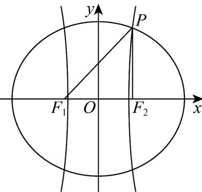
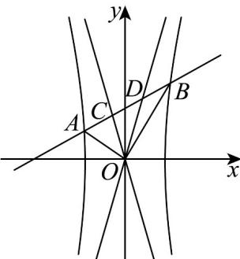

> [!faq]- 《专题11_双曲线标准方程及其性质全方位总结_十大题型__高效培优期中专》官方解析
>
> > [!success]- **【答案】** $\left(\frac{1}{3}, +\infty\right)$
>
> > [!note]- **【分析】**
> > 根据等腰三角形三边关系可构造不等式求得 $c$ 的范围，根据双曲线和椭圆定义可利用 $c$ 表示出 $e_1, e_2$ ，从而得到 $e_1 e_2 = \frac{1}{\frac{144}{c^2} - 1}$ ，结合 $c$ 的范围可得结果。
>
> > [!note]- **【解析】**
> > 
> >
> > 设椭圆与双曲线的半焦距为 c，椭圆长半轴为 $a_{1}$ ，双曲线实半轴为 $a_{2}$ ， $\left|PF_{1}\right|=r_{1}$ ， $\left|PF_{2}\right|=r_{2}$ ，
> > ∵ $\triangle PF_{1}F_{2}$ 是以 $PF_{1}$ 为底边的等腰三角形，点 P 在第一象限内，
> >
> > $$
> > \therefore \left| P F _ {2} \right| = \left| F _ {1} F _ {2} \right|, \left| P F _ {1} \right| > \left| P F _ {2} \right|, \left| P F _ {2} \right| + \left| F _ {1} F _ {2} \right| > \left| P F _ {1} \right|
> > $$
> >
> > 即 $r_1 = 24$ ， $r_2 = 2c$ ，且 $r_1 > r_2$ ， $2r_2 > r_1$
> >
> > ∴ 2c < 24，4c > 24，解得：6 < c < 12
> >
> > 在双曲线中， $\left|PF_{1}\right|-\left|PF_{2}\right|=2a_{2}$ ， $\therefore e_{2}=\frac{c}{a_{2}}=\frac{2c}{2a_{2}}=\frac{2c}{r_{1}-r_{2}}=\frac{2c}{24-2c}=\frac{c}{12-c}$ ；
> >
> > 在椭圆中， $\left|PF_{1}\right|+\left|PF_{2}\right|=2a_{1}$ ， $\therefore e_{1}=\frac{c}{a_{1}}=\frac{2c}{2a_{1}}=\frac{2c}{r_{1}+r_{2}}=\frac{2c}{24+2c}=\frac{c}{12+c}$ ；
> >
> > $$
> > \therefore e _ {1} e _ {2} = \frac {c}{1 2 + c} \cdot \frac {c}{1 2 - c} = \frac {1}{\frac {1 4 4}{c ^ {2}} - 1}
> > $$
> >
> > ∵ 6 < c < 12，∴ $36 < c^{2} < 144$ ，则 $1 < \frac{144}{c^{2}} < 4$ ，∴ $0 < \frac{144}{c^{2}} - 1 < 3$ ，
> >
> > 可得： $\frac{1}{\frac{144}{c^2} - 1} >\frac{1}{3}$
> >
> > $\therefore e_{1}e_{2}$ 的取值范围为 $\left(\frac{1}{3}, + \infty\right)$ .
> >
> > 故答案为： $\left(\frac{1}{3}, + \infty\right)$
> >
> > 53. 直线 $l$ 与双曲线 $\Gamma: \frac{x^2}{a^2} - \frac{y^2}{b^2} = 1 (a > 0, b > 0)$ 的左、右两支分别交于 $A$ 、 $B$ 两点，与双曲线的两条渐近线分别交于 $C$ 、 $D$ 两点（ $A, C, D, B$ 从左到右依次排列），若 $OA \perp OB$ ，且 $\left|AC\right|$ ， $\left|CD\right|$ ， $\left|DB\right|$ 成等差数列，则双曲线「的离心率的取值范围是\_\_\_\_。
> >
> > 【答案】 $\left[\sqrt{10},+\infty\right)$
> >
> > 【分析】先设直线方程及四个点，联立后分别求出两根和和两根积，根据 $OA \perp OB$ 得出
> >
> > $m^2 = \frac{a^2b^2(k^2 + 1)}{b^2 - a^2} > 0$ ，再利用 $\left|AC\right|$ ， $\left|CD\right|$ ， $\left|DB\right|$ 成等差数列，可得 $\left|AB\right| = 3\left|CD\right|$ ，利用 $\left|x_1 - x_2\right| = 3\left|x_3 - x_4\right|$ 及韦达定理进行化简可得出 $k^2 = \frac{b^2(b^2 - 9a^2)}{a^2(9b^2 - a^2)}$ 0，即可求离心率的范围·
> >
> > 【详解】由题意可知，直线 $AB$ 的斜率存在，故设直线 $AB:y = kx + m$
> >
> > 设 $A(x_{1},y_{1}),B(x_{2},y_{2}),C(x_{3},y_{3}),D(x_{4},y_{4})$
> >
> > 联立 $\left\{ \begin{array}{l} y = kx + m \\ \frac{x^2}{a^2} - \frac{y^2}{b^2} = 1 \end{array} \right.$ ，可得 $\left(b^2 - a^2k^2\right)x^2 - 2ka^2mx - a^2m^2 - a^2b^2 = 0$
> >
> > 则 $x_{1} + x_{2} = \frac{-2a^{2}km}{a^{2}k^{2} - b^{2}}$ ， $x_{1}x_{2} = \frac{a^{2}m^{2} + a^{2}b^{2}}{a^{2}k^{2} - b^{2}}$ 则 $\left|x_{1}-x_{2}\right|^{2}=\left(x_{1}+x_{2}\right)^{2}-4x_{1}x_{2}=\left(\frac{-2a^{2}km}{a^{2}k^{2}-b^{2}}\right)^{2}-4\times\frac{a^{2}m^{2}+a^{2}b^{2}}{a^{2}k^{2}-b^{2}}$ $=\frac{4\left(a^{2}m^{2}b^{2}-a^{4}b^{2}k^{2}+a^{2}b^{4}\right)}{\left(a^{2}k^{2}-b^{2}\right)^{2}}$ 联立 $\left\{\begin{aligned}y&=kx+m\\\frac{x^{2}}{a^{2}}-\frac{y^{2}}{b^{2}}&=0\end{aligned}\right.$ ，可得 $\left(b^{2}-a^{2}k^{2}\right)x^{2}-2ka^{2}mx-a^{2}m^{2}=0$ 则 $x_{3}+x_{4}=\frac{-2a^{2}km}{a^{2}k^{2}-b^{2}}$ ， $x_{3}x_{4}=\frac{a^{2}m^{2}}{a^{2}k^{2}-b^{2}}$ 则 $\left|x_{3}-x_{4}\right|^{2}=\left(x_{3}+x_{4}\right)^{2}-4x_{3}x_{4}=\left(\frac{-2a^{2}km}{a^{2}k^{2}-b^{2}}\right)^{2}-4\times\frac{a^{2}m^{2}}{a^{2}k^{2}-b^{2}}=\frac{4a^{2}m^{2}b^{2}}{\left(a^{2}k^{2}-b^{2}\right)^{2}}$ 因为 $OA\perp OB$ ，所以 $OA\cdot OB=x_{1}x_{2}+y_{1}y_{2}=x_{1}x_{2}+\left(kx_{1}+m\right)\left(kx_{2}+m\right)=0$ 即 $\left(k^{2}+1\right)x_{1}x_{2}+km\left(x_{1}+x_{2}\right)+m^{2}&=0$ 则 $\left(k^{2}+1\right)\cdot\frac{a^{2}m^{2}+a^{2}b^{2}}{a^{2}k^{2}-b^{2}}+km\left(\frac{-2a^{2}km}{a^{2}k^{2}-b^{2}}\right)+m^{2}=0$ 化简得 $m^{2}=\frac{a^{2}b^{2}\left(k^{2}+1\right)}{b^{2}-a^{2}}$ 因为 $m^{2}>0$ ，所以 $b^{2}>a^{2}$ ，所以 $e^{2}=\frac{c^{2}}{a^{2}}=1+\frac{b^{2}}{a^{2}}>2$ ，即得 $e>\sqrt{2}$ 因为 $x_{3}+x_{4}=x_{1}+x_{2}$ ，所以CD中点为AB的中点，所以 $|AC|=|BD|$ 因为 $|AC|,|CD|,|BD|$ 成等差数列，所以 $|AC|=|CD|=|BD|$ 又因为A,C,D,B从左到右依次排列，所以 $|AB|=3|CD|$ 所以 $|x_{1}-x_{2}|=3|x_{3}-x_{4}|$ 则 $\frac{4\left(a^{2}m^{2}b^{2}-a^{4}b^{2}k^{2}+a^{2}b^{4}\right)}{\left(a^{2}k^{2}-b^{2}\right)^{2}}=9\times\frac{4a^{2}m^{2}b^{2}}{\left(a^{2}k^{2}-b^{2}\right)^{2}}$ 得 $k^{2}=\frac{b^{2}-8m^{2}}{a^{2}}$
> >
> > 与 $m^2 = \frac{a^2b^2(k^2 + 1)}{b^2 - a^2}$ 联立得， $k^2 = \frac{b^2(b^2 - 9a^2)}{a^2(9b^2 - a^2)}$
> >
> > 因 $b^{2} > a^{2}$ ，则 $9b^{2} > a^{2}$
> >
> > 又 $k^2$ 0，则 $b^{2}$ $9a^{2}$ ，则 $e^2 = \frac{c^2}{a^2} = 1 + \frac{b^2}{a^2}$ 10，则 $e\sqrt{10}$ ，
> >
> > 综上，双曲线「的离心率的取值范围是 $\left[\sqrt{10},+\infty\right)$ .
> >
> > 故答案为： $\left[\sqrt{10},+\infty\right)$
> >
> > 
