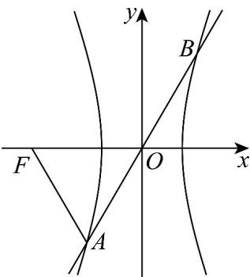

> [!faq]- 《专题11_双曲线标准方程及其性质全方位总结_十大题型__高效培优期中专》官方解析
>
> > [!success]- **【答案】** $\sqrt{3} + 1 / 1 + \sqrt{3}$
>
> > [!note]- **【分析】**
> > 利用双曲线的对称性和题设条件，推出正三角形 $\triangle AOF$ ，求得点 $A$ 的坐标，代入双曲线方程，化成关于 $a, c$ 的齐次方程，解方程即得：
>
> > [!note]- **【解析】**
> > 
> >
> > 如图，因直线 $l:y = \sqrt{3} x$ 与双曲线 $C:\frac{x^2}{a^2} -\frac{y^2}{b^2} = 1(a > 0,b > 0)$ 的图象均关于原点对称，故
> >
> > $$
> > \mid O A \mid = \frac {1}{2} \mid A B \mid = \mid A F \mid
> > $$
> >
> > 且直线 $l$ 的斜率为 $\sqrt{3}$ ，故倾斜角为 $60^{\circ}$ ，即 $\angle FOA = 60^{\circ}$ ，则 $\triangle AOF$ 是正三角形，
> >
> > 则可得点 $A$ 的坐标为 $A(-\frac{c}{2}, - \frac{\sqrt{3}}{2} c)$ ，代入 $\frac{x^2}{a^2} -\frac{y^2}{b^2} = 1$ ，整理得：
> >
> > $$
> > b ^ {2} c ^ {2} - 3 a ^ {2} c ^ {2} = 4 a ^ {2} b ^ {2}
> > $$
> >
> > 因 $b^{2} = c^{2} - a^{2}$ ，代入整理得： $c^4 -8a^2 c^2 +4a^4 = 0$
> >
> > 即 $e^4 - 8e^2 + 4 = 0$ ，解得 $e = \sqrt{3} \pm 1$ ，因 $e > 1$ ，故 $e = \sqrt{3} + 1$ .
> >
> > 故答案为： $\sqrt{3} + 1$
