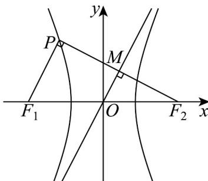

> [!faq]- 《专题11_双曲线标准方程及其性质全方位总结_十大题型__高效培优期中专》官方解析
>
> > [!success]- **【答案】** D
>
> > [!note]- **【分析】**
> > 根据对称性利用中位线性质求得 $OM = 1$ ，再利用渐近线的斜率与直角三角形中角的正切值相等关系 $\frac{b}{a} = \frac{MF_2}{OM} = b$ 待定 $a$ ，进而得到相关长度求面积即可·
>
> > [!note]- **【解析】**
> > 由对称性，不妨设点 $F_{2}$ 关于渐近线 $y = \frac{b}{a} x$ 的对称点为 $P$ ，设 $PF_{2}$ 与该渐近线交于点 $M$ ，则 $F_{2}M \perp OM$ ，且 $\left|MP\right| = \left|MF_{2}\right|$ .
> >
> > 由 O, M 分别是 $F_{1}F_{2}$ 与 $PF_{2}$ 的中点，知 $OM \parallel PF_{1}$ 且 $\left|OM\right| = \frac{1}{2}\left|PF_{1}\right| = 1$
> >
> > 又右焦点 $F_{2}(c,0)$ ，渐近线方程 $y = \frac{b}{a} x$ 即 $bx - ay = 0$
> >
> > 故点 $F_{2}$ 到渐近线 $bx - ay = 0$ 的距离为 $\left|MF_2\right| = \frac{\left|bc\right|}{\sqrt{b^2 + a^2}} = \frac{bc}{c} = b$
> >
> > 则在 $\mathrm{Rt}\triangle OMF_2$ 中， $\tan \angle MOF_2 = \frac{b}{a} = \frac{|MF_2|}{|OM|} = |MF_2| = b$ ，解得 $a = 1$
> >
> > 所以由 $e = \sqrt{5}$ 得 $\frac{c}{a} = \sqrt{5} = c$ ， $b = \sqrt{c^2 - a^2} = 2$
> >
> > 所以 $S_{\triangle PF_{1}F_{2}} = 4S_{\triangle OMF_{2}} = 4 \times \frac{1}{2} |OM| \cdot |MF_{2}| = 2b = 4$ .
> >
> > 故选：D.
> >
> > 
