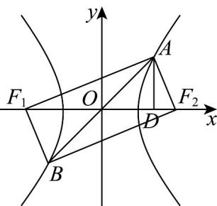

> [!faq]- 《专题11_双曲线标准方程及其性质全方位总结_十大题型__高效培优期中专》官方解析
>
> > [!success]- **【答案】** $x^{2}-\frac{y^{2}}{3}=1$
>
> > [!note]- **【分析】**
> > 设双曲线方程，根据题设可推得矩形 $AF_{1}BF_{2}$ ，利用四边形 $AF_{1}BF_{2}$ 的面积为 6 求出 $|AD|$ ，即得点 $A$ 的坐标，代入双曲线方程，计算即得
>
> > [!note]- **【解析】**
> > 
> >
> > 如图，设双曲线的方程为： $\frac{x^{2}}{a^{2}}-\frac{y^{2}}{b^{2}}=1,(a>0,b>0)$ ，
> >
> > 过点 A 作 $AD \perp F_{1}F_{2}$ 于点 D，因点 A, B 关于原点对称，又 $\left|AB\right| = \left|F_{1}F_{2}\right|$ ，则四边形 $AF_{1}BF_{2}$ 为矩形， $\left|OA\right| = \left|OF_{2}\right| = 2$ ，由四边形 $AF_{1}BF_{2}$ 的面积为 6，得 $\left|F_{1}F_{2}\right| \times \left|AD\right| = 6$ ，因 $\left|F_{1}F_{2}\right| = 4$ ，则 $\left|AD\right| = \frac{3}{2}$ ，
> >
> > 于是 $|OD| = \sqrt{|OA|^2 - |AD|^2} = \frac{\sqrt{7}}{2}$ ，如图可取 $A(\frac{\sqrt{7}}{2}, \frac{3}{2})$ ，
> >
> > 代入双曲线方程可得， $\left\{ \begin{array}{l} \frac{7}{4a^2} - \frac{9}{4b^2} = 1 \\ a^2 + b^2 = 4 \end{array} \right.$ ，解得， $\left\{ \begin{array}{l} a = 1 \\ b = \sqrt{3} \end{array} \right.$
> >
> > 故双曲线 C 的方程为 $x^{2}-\frac{y^{2}}{3}=1$ .
> >
> > 故答案为： $x^{2}-\frac{y^{2}}{3}=1$ .
