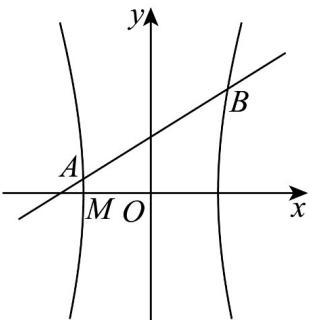

> [!faq]- 《专题11_双曲线标准方程及其性质全方位总结_十大题型__高效培优期中专》官方解析
>
> > [!success]- **【答案】** (1) $x^{2}-\frac{y^{2}}{8}=1$ (2) $y = x + 1$ . (3)证明见解析
>
> > [!note]- **【分析】**
> > （1）利用离心率公式和双曲线 $a, b, c$ 的关系得到双曲线方程；
> >
> > (2) 根据点差法结合线段中点坐标解得直线的斜率，从而解得答案；
> >
> > (3) 设直线 $AB$ 的方程为 $x = ty + n$ ，联立方程组消元得到 $\left(8t^2 - 1\right)y^2 + 16nty + 8n^2 - 8 = 0$ 通过韦达定理有 $y_1 + y_2 = -\frac{16nt}{8t^2 - 1}$ ， $y_1y_2 = -\frac{8n^2 - 8}{8t^2 - 1}$ ，结合 $\overline{MA} \cdot \overline{MB} = 0$ ，化简得 $7n^2 - 2n - 9 = 0$ ，解得 $n = \frac{9}{7}$ 或 $-1$ ，当 $n = -1$ 和 $n = \frac{9}{7}$ 时，分别分析直线 $AB$ 的方程，进而求得定点；
>
> > [!note]- **【解析】**
> > （1）因为 $a = 1$ ， $\mathrm{e} = \frac{c}{a} = \sqrt{1 + \frac{b^2}{a^2}} = \sqrt{1 + b^2} = 3$
> >
> > 所以 $b^{2} = 8$ ，故 $C$ 的标准方程为 $x^{2} - \frac{y^{2}}{8} = 1\cdot$
> >
> > (2)
> >
> > 
> >
> > 设 $A(x_{1},y_{1})$ ， $B(x_{2},y_{2})$ ，根据题意易得 $x_{1} \neq x_{2}$ .
> >
> > 因为 是 上的两点，所以 $\left\{\begin{aligned}x_{1}^{2}-\frac{y_{1}^{2}}{8}&=1\\ x_{2}^{2}-\frac{y_{2}^{2}}{8}&=1\end{aligned}\right.$
> >
> > 两式相减得 $x_{1}^{2} - x_{2}^{2} - \frac{y_{1}^{2} - y_{2}^{2}}{8} = 0$ ，即 $\frac{y_1 - y_2}{x_1 - x_2} = \frac{8(x_1 + x_2)}{y_1 + y_2}$
> >
> > 因为 $x_{1} + x_{2} = \frac{2}{7}$ ， $y_{1} + y_{2} = \frac{16}{7}$
> >
> > 所以 $k_{AB}=\frac{y_{1}-y_{2}}{x_{1}-x_{2}}=\frac{8(x_{1}+x_{2})}{y_{1}+y_{2}}=1$
> >
> > 所以直线 $AB$ 的方程为 $y = \left(x - \frac{1}{7}\right) + \frac{8}{7} = x + 1$
> >
> > 经检验，此时直线 AB 与双曲线 C 有两个交点，满足题意，则直线 AB 的方程为 $y = x + 1$ .
> >
> > (3) 证明：依题意可设直线 $AB$ 的方程为 $x = ty + n$ .
> >
> > 由 $\left\{\begin{aligned}x^{2}-\frac{y^{2}}{8}&=1\\ x&=ty+n\end{aligned}\right.$ ，得 $\left(8t^{2}-1\right)y^{2}+16nty+8n^{2}-8=0$
> >
> > 则 $y_{1} + y_{2} = -\frac{16nt}{8t^{2}-1}$ ， $y_{1}y_{2} = -\frac{8n^{2}-8}{8t^{2}-1}$ ， $\Delta > 0$
> >
> > $M(-1,0)$ ，由（2）知 $\overline{MA} = (x_{1} + 1, y_{1}) = (ty_{1} + n + 1, y_{1})$ ， $\overline{MB} = (x_{2} + 1, y_{2}) = (ty_{2} + n + 1, y_{2})$
> >
> > 因为 $\stackrel{\square\square}{MA}\cdot\stackrel{\square\square\square}{MB}=0$ ，所以 $(ty_{1}+n+1)(ty_{2}+n+1)+y_{1}y_{2}=0$
> >
> > 即 $\left(t^2 + 1\right)y_1y_2 + t(n + 1)\left(y_1 + y_2\right) + (n + 1)^2 = 0$
> >
> > $$
> > \left(t ^ {2} + 1\right) \cdot \frac {8 n ^ {2} - 8}{8 t ^ {2} - 1} + t (n + 1) \left(- \frac {1 6 t n}{8 t ^ {2} - 1}\right) + (n + 1) ^ {2} = 0
> > $$
> >
> > 即 $\left(t^{2} + 1\right)\left(8n^{2} - 8\right) - 16t^{2}n(n + 1) + \left(8t^{2} - 1\right)\left(n + 1\right)^{2} = 0$ ，得 $7n^{2} - 2n - 9 = 0$ ，解得 $n = \frac{9}{7}$ 或 $-1\cdot$
> >
> > 当 $n = -1$ 时，直线 $AB: x = ty - 1$ ，直线 $AB$ 过点 $M(-1,0)$ ，不符合题意，舍去；
> >
> > 当 $n = \frac{9}{7}$ 时，直线 $AB:x = ty + \frac{9}{7}$ ，满足 $\Delta >0$ ，则直线 $AB$ 过定点 $\left(\frac{9}{7},0\right)$
> >
> > 故直线 $AB$ 过定点 $\left(\frac{9}{7},0\right)$
