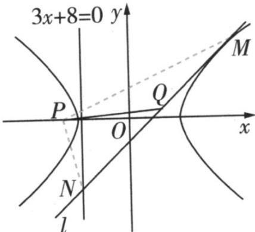

> [!faq]- 《专题11_双曲线标准方程及其性质全方位总结_十大题型__高效培优期中专》官方解析
>
> > [!success]- **【答案】** (1) $\frac{x^{2}}{8}-y^{2}=1$ (2)在 $x$ 轴上存在定点 $P$ ，使得 $\left|PQ\right| = \frac{1}{2}\left|M N\right|$ ，且 $P$ 点坐标为(-3,0)
>
> > [!note]- **【分析】**
> > （1）根据双曲线 $C$ 的离心率 $\mathrm{e} = \frac{3\sqrt{2}}{4}$ ，以及点(4,-1)在双曲线上联立即可·
> >
> > (2) 根据题意，设直线 $l$ 的方程 $y = kx + m (k \neq 0)$ ，直线与双曲线联立方程组可得 $M\left(-\frac{8k}{m}, -\frac{1}{m}\right)$ ，直线 $l$ 与直线 $3x + 8 = 0$ 相交可求得 $N\left(-\frac{8}{3}, - \frac{8k}{3} +m\right)$ ，假设存在定点 $_P$ ，使得 $|PQ| = \frac{1}{2}|MN|$ ，由题中条件可得 $PM\perp PN$ ，利用 $\overline{PM}\cdot \overline{PN} = 0$ 进行计算即可·
>
> > [!note]- **【解析】**
> > （1）设双曲线 C 的标准方程为 $\frac{x^{2}}{a^{2}} - \frac{y^{2}}{b^{2}} = 1$ （a > 0, b > 0），
> >
> > 由已知得 $\left\{ \begin{array}{l} \frac{\sqrt{a^2 + b^2}}{a} = \frac{3\sqrt{2}}{4} \\ \frac{16}{a^2} - \frac{1}{b^2} = 1 \end{array} \right.$ ，解得 $\left\{ \begin{array}{l} a^2 = 8 \\ b^2 = 1 \end{array} \right.$
> >
> > 故双曲线 $C$ 的标准方程为 $\frac{x^2}{8} - y^2 = 1$
> >
> > (2) 依题意，直线 l 的斜率必存在，设其方程为 $y = kx + m (k \neq 0)$ ,
> >
> > 由 $\left\{ \begin{array}{l} \frac{x^2}{8} - y^2 = 1 \\ y = kx + m \end{array} \right.$ ，可得 $\left(1 - 8k^2\right)x^2 - 16kmx - \left(8m^2 + 8\right) = 0$ ，因为直线与双曲线的右支相切于点 $M$ 设 $M(x_1, y_1)$ ，则有 $\Delta = (-16km)^2 + 4\left(1 - 8k^2\right)\left(8m^2 + 8\right) = 0$ ，
> >
> > 整理得 $m^2 = 8k^2 - 1$ ，由根与系数的关系可得 $2x_1 = \frac{16km}{1 - 8k^2}$ ，则 $x_1 = \frac{8km}{1 - 8k^2} = -\frac{8k}{m}$ ，
> >
> > 于是 $y_{1} = kx_{1} + m = -\frac{1}{m}$ ，即 $M\left(-\frac{8k}{m}, - \frac{1}{m}\right)$ ，又直线 $l$ 与直线 $3x + 8 = 0$ 相交于点 $N$ ，所以 $N\left(-\frac{8}{3}, - \frac{8k}{3} +m\right)$
> >
> > 假设存在定点 $P$ ，使得 $\left|PQ\right| = \frac{1}{2}\left|M N\right|$ ，如图，连接 $PM$ ， $PN$ ，因为线段 $MN$ 的中点为 $Q$ ，
> >
> > 所以 $PM \perp PN$ ，即 $PM \cdot PN = 0$
> >
> > 不妨设 $P(x_0,0)$ ，则 $\overline{PM} = \left(-\frac{8k}{m} -x_0, - \frac{1}{m}\right)$ ， $\overline{PN} = \left(-\frac{8}{3} -x_0, - \frac{8k}{3} +m\right)$
> >
> > 得到 $\overrightarrow{PM} \cdot \overrightarrow{PN} = \left( \frac{-8k}{m} - x_{0} \right) \left( \frac{-8}{3} - x_{0} \right) - \frac{1}{m} \left( \frac{-8k}{3} + m \right) = \frac{8k(x_{0} + 3)}{m} + \left( x_{0}^{2} + \frac{8x_{0}}{3} - 1 \right) = 0$
> >
> > 所以有 $\left\{ \begin{array}{l}x_0 + 3 = 0\\ x_0^2 +\frac{8x_0}{3} -1 = 0 \end{array} \right.$ ，解得 $x_0 = -3$ ，即 $P(-3,0)$
> >
> > 故在 $x$ 轴上存在定点 $P(-3,0)$ ，使得 $|PQ| = \frac{1}{2} |MN|$
> >
> > 
