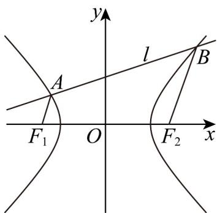

> [!faq]- 《专题11_双曲线标准方程及其性质全方位总结_十大题型__高效培优期中专》官方解析
>
> > [!success]- **【答案】** (1) $x^{2}-y^{2}=1$ (2)3 (3) $\sqrt{3} x \pm y + \sqrt{6} = 0$
>
> > [!note]- **【分析】**
> > （1）根据题意结合等轴双曲线的定义列式求 $a, b, c$ ，即可得方程；
> >
> > (2) 设直线 $AB: x = 3y + m(m < 0)$ ， $A(x_1, y_1), B(x_2, y_2)$ ，根据向量平行可得 $\frac{y_2}{y_1} = \frac{m - \sqrt{2}}{m + \sqrt{2}}$ ，结合韦达定理可得 $m = -\sqrt{10}$ ，代入运算求解即可；
> >
> > （3）根据双曲线方程利用两点间距离公式和倾斜角推得 $\left|AF_{1}\right|=\frac{1}{1+\sqrt{2}\cos\theta}$ ， $\left|BF_{2}\right|=\frac{1}{1-\sqrt{2}\cos\theta}$ ，结合面积关系可得 $\sin\theta=\frac{\sqrt{3}}{2}$ ，即可得结果·
>
> > [!note]- **【解析】**
> > （1）由题意可知： $\left\{\begin{aligned}a&=b\\ 2c&=2\sqrt{2}\\ c^{2}&=a^{2}+b^{2}\end{aligned}\right.$ ，解得 $\left\{\begin{aligned}a&=b=1\\ c&=\sqrt{2}\end{aligned}\right.$
> >
> > 所以双曲线 $\Gamma$ 的方程为 $x^{2}-y^{2}=1$ .
> >
> > (2) 由 (1) 可知： $F_{1}(-\sqrt{2},0), F_{2}(\sqrt{2},0)$
> >
> > 
> >
> > 设直线 $AB: x = 3y + m(m < 0)$ ， $A(x_{1}, y_{1}), B(x_{2}, y_{2})$
> >
> > 联立方程 $\left\{ \begin{array}{l}x = 3y + m\\ x^2 -y^2 = 1 \end{array} \right.$ ，消去 $x$ 可得 $8y^{2} + 6my + m^{2} - 1 = 0$
> >
> > 则 $\Delta = 36m^2 - 32(m^2 - 1) = 4m^2 + 32 > 0$ ，可得 $y_1 + y_2 = -\frac{3}{4} m, y_1y_2 = \frac{m^2 - 1}{8}$ ，
> >
> > 因为 $F_{1}A=\left(x_{1}+\sqrt{2},y_{1}\right),F_{2}B=\left(x_{2}-\sqrt{2},y_{2}\right)$
> >
> > 若 $AF_{1} / / BF_{2}$ ，则 $\left(x_{1} + \sqrt{2}\right)y_{2} = \left(x_{2} - \sqrt{2}\right)y_{1}$
> >
> > 即 $\left(3y_{1} + m + \sqrt{2}\right)y_{2} = \left(3y_{2} + m - \sqrt{2}\right)y_{1}$ ，整理可得 $\frac{y_2}{y_1} = \frac{m - \sqrt{2}}{m + \sqrt{2}}$
> >
> > 又因为 $\frac{\left(y_1 + y_2\right)^2}{y_1y_2} = \frac{y_1}{y_2} +\frac{y_2}{y_1} +2$
> >
> > 可得 $\frac{\left(-\frac{3}{4}m\right)^2}{\frac{m^2 - 1}{8}} = \frac{m + \sqrt{2}}{m - \sqrt{2}} + \frac{m - \sqrt{2}}{m + \sqrt{2}} + 2$ ，解得 $m = -\sqrt{10}$ ，
> >
> > 此时 $8y^{2} + 6my + m^{2} - 1 = 0$ 即为 $8y^{2} - 6\sqrt{10} y + 9 = 0$ ，解得 $y = \frac{3\sqrt{10} - 3\sqrt{2}}{8}$ 或 $y = \frac{3\sqrt{10} + 3\sqrt{2}}{8}$ （舍去），此时 $x = 3y - \sqrt{10} = \frac{\sqrt{10} - 9\sqrt{2}}{8}$ ，即 $A\left(\frac{\sqrt{10} - 9\sqrt{2}}{8},\frac{3\sqrt{10} - 3\sqrt{2}}{8}\right)$
> >
> > 所以直线 $\frac{AF_{1}}{AF_{1}}$ 的斜率 $k_{AF_{1}} = \frac{\frac{3\sqrt{10} - 3\sqrt{2}}{8}}{\frac{\sqrt{10} - 9\sqrt{2}}{8} + \sqrt{2}} = 3$ .
> >
> > (3) 设 $A(x_{1}, y_{1}), B(x_{2}, y_{2})$
> >
> > 则 $x_{1}^{2} - y_{1}^{2} = 1$ ，即 $y_{1}^{2} = x_{1}^{2} - 1$
> >
> > 可得 $\left|AF_1\right| = \sqrt{\left(x_1 + \sqrt{2}\right)^2 + y_1^2} = \sqrt{x_1^2 + 2\sqrt{2}x_1 + 2 + x_1^2 - 1} = \sqrt{2x_1^2 + 2\sqrt{2}x_1 + 1} = -\sqrt{2} x_1 - 1$
> >
> > 设直线 $AF_{1}$ 的倾斜角为 $\theta\in[0,\pi)$ ，则 $x_{1}=\left|AF_{1}\right|\cos\theta-\sqrt{2}$
> >
> > 可得 $\left|AF_{1}\right|=-\sqrt{2}\left(\left|AF_{1}\right|\cos\theta-\sqrt{2}\right)-1$ ，解得 $\left|AF_{1}\right|=\frac{1}{1+\sqrt{2}\cos\theta}$ ，
> >
> > 同理可得 $\left|BF_{2}\right|=\frac{1}{1-\sqrt{2}\cos\theta}$ ，
> >
> > 此时梯形 $AF_{1}F_{2}B$ 的高为 $\left|F_{1}F_{2}\right|\sin\theta=2\sqrt{2}\sin\theta$
> >
> > 可知梯形 $AF_{1}F_{2}B$ 的面积 $S_{AF_1F_2B} = \frac{1}{2}\times 2\sqrt{2}\sin \theta \times \left(\frac{1}{1 + \sqrt{2}\cos\theta} +\frac{1}{1 - \sqrt{2}\cos\theta}\right) = \frac{2\sqrt{2}\sin\theta}{2\sin^2\theta - 1} = 2\sqrt{6}$
> >
> > 整理可得 $2\sqrt{3}\sin^2\theta -\sin \theta -\sqrt{3} = 0$ ，解得 $\sin \theta = \frac{\sqrt{3}}{2}$ 或 $\sin \theta = -\frac{\sqrt{3}}{3}$ （舍去），
> >
> > 可知 $\theta = \frac{\pi}{3}$ 或 $\theta = \frac{2\pi}{3}$ ，则直线 $AF_{1}$ 的斜率 $k_{AF_1} = \pm \sqrt{3}$
> >
> > 所以直线 $AF_{1}$ 的方程 $y = \pm \sqrt{3}(x - \sqrt{2})$ ，即 $\sqrt{3}x \pm y + \sqrt{6} = 0$ 。
