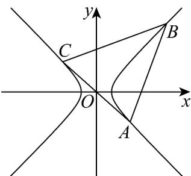

> [!faq]- 《专题11_双曲线标准方程及其性质全方位总结_十大题型__高效培优期中专》官方解析
>
> > [!success]- **【答案】** $x^{2} - y^{2} = 2$
>
> > [!note]- **【分析】**
> > 设 $\vee ABC$ 垂心坐标为 $H(x,y)$ ，且 $\vee ABC$ 三个顶点都在等轴双曲线 $y = \frac{k}{x}$ 上，即
> >
> > $A(a,\frac{k}{a}),B(b,\frac{k}{b}),C(c,\frac{k}{c})$ ，再计算边AB,BC的垂线方程，并求垂心H的坐标，可得垂心的横纵坐标的乘积为
> > xy = k，即 $\forall ABC$ 垂心的轨迹方程就是等轴双曲线本身.
>
> > [!note]- **【解析】**
> > 等轴双曲线 $x^{2} - y^{2} = 2$ 上三点 $A, B, C$ 的垂心的轨迹方程就是等轴双曲线 $x^{2} - y^{2} = 2$ 本身. 证明如下：
> >
> > 由题意，反比例函数 $y = \frac{k}{x} (k > 0)$ 可由等轴双曲线 $x^{2} - y^{2} = a^{2}$ 绕原点逆时针旋转 $\frac{\pi}{4}$ 得到，
> >
> > 故证明采用反比例函数 $y=\frac{k}{x}(k>0)$ .
> >
> > 设 $\vee ABC$ 垂心的坐标为 $H(x,y)$ ，且 $\vee ABC$ 三个顶点都在等轴双曲线 $y = \frac{k}{x}$ 上，
> >
> > 设 $\vee ABC$ 三个顶点坐标为 $A(a, \frac{k}{a}), B(b, \frac{k}{b}), C(c, \frac{k}{c})$ ,
> >
> > 所以直线 AB 的方程为 $y - \frac{k}{a} = \frac{\frac{k}{b} - \frac{k}{a}}{b - a}(x - a)$ ，
> >
> > 即 $y - \frac{k}{a} = -\frac{k}{ab} (x - a)$
> >
> > 因为 $AB \perp CH$ ，即 $k_{CH} = \frac{ab}{k}$ ，
> >
> > 所以直线 CH 的方程为 $y - \frac{k}{c} = \frac{ab}{k}(x - c)$ ,
> >
> > 同理由 $BC \perp AH$ ，即 $k_{AH} = \frac{bc}{k}$
> >
> > 所以直线 AH 的方程为 $y - \frac{k}{a} = \frac{bc}{k}(x - a)$ ,所以由 $\left\{\begin{aligned}y-\frac{k}{c}&= \frac{ab}{k}(x-c)\\ y-\frac{k}{a}&=\frac{bc}{k}(x-a)\end{aligned}\right.$ 解得 的垂心坐标为 $\left\{\begin{aligned}x&=-\frac{k^{2}}{abc}\\ y&=-\frac{abc}{k}\end{aligned}\right.$ 即垂心的横纵坐标的乘积为 xy=k ，
> > 所以 VABC 垂心的轨迹方程就是原来的等轴双曲线本身
> > 故答案为： $x^{2}-y^{2}=2$
> >
> > 
