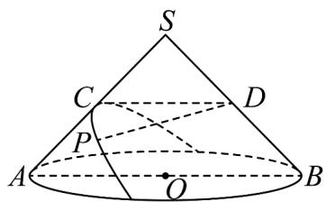

<!-- question-source:start -->
11. 如图，已知 Rt△SAB 是圆锥 SO 的轴截面，C，D 分别为 SA，SB 的中点，过点 C 且与直线 SA 垂直的平面截圆锥，截口曲线 $\Gamma$ 是抛物线的一部分。若 P 在 $\Gamma$ 上，则 $\frac{|DP|}{|DC|}$ 的取值范围是 \_\_\_\_。

<!-- question-source:end -->

![[高中/课堂同步/题库/人教A版高中数学同步讲义(2026)/03_选择性必修第一册/期中专项训练+期中模拟卷/专项训练/专题12_抛物线标准方程及其性质全方位总结_八大题型__高效培优期中专/_compact/answers/Q00062560A1.md]]
