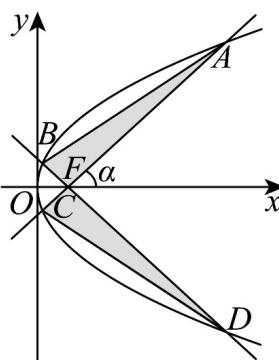

<!-- question-source:start -->
46．已知抛物线 $C: y^{2} = 8x$ ，其中 AC，BD 是过抛物线焦点 F 的两条互相垂直的弦，直线 AC 的倾斜角为 $\alpha$ ，当 $\alpha = 45^{\circ}$ 时，如图所示的“蝴蝶形图案（阴影区域）”的面积为（）

A. 4 B. 8 C. 16 D. 32
<!-- question-source:end -->

![[高中/课堂同步/题库/人教A版高中数学同步讲义(2026)/03_选择性必修第一册/期中专项训练+期中模拟卷/专项训练/专题12_抛物线标准方程及其性质全方位总结_八大题型__高效培优期中专/_compact/answers/Q00062594A1.md]]
