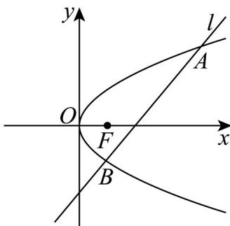

<!-- question-source:start -->
51. 已知抛物线 $C$ 关于 $x$ 轴对称，它的顶点在原点 $O$ ，并且经过点 $\left(2, -2\sqrt{2}\right)$ .

(1)求抛物线 $C$ 的标准方程；

(2)设直线 $l: x = my + 2$ 与 $C$ 交于 $A, B$ 两点.

①当 $m = 1$ 时，求 $\triangle OAB$ 的面积 $S_{\triangle OAB}$ ；

②过点 A, B 分别作抛物线 C 的切线交于点 P，证明：点 P 在定直线 x = -2 上.
<!-- question-source:end -->

![[高中/课堂同步/题库/人教A版高中数学同步讲义(2026)/03_选择性必修第一册/期中专项训练+期中模拟卷/专项训练/专题12_抛物线标准方程及其性质全方位总结_八大题型__高效培优期中专/_compact/answers/Q00062599A1.md]]
