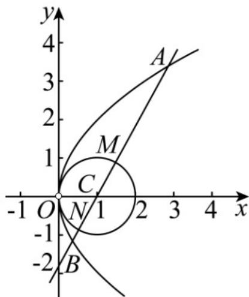

> [!faq]- 《专题12_抛物线标准方程及其性质全方位总结_八大题型__高效培优期中专》官方解析
>
> > [!success]- **【答案】** (1) $y^{2}=4x(x>0)$ (2) $|AB|=6$ $y=\pm\sqrt{2}(x-1)$
>
> > [!note]- **【分析】**
> > （1）易得圆的半径 $r = 1$ ，圆心 $C(1,0)$ ，由题意得到点 $P$ 到定点 $C(1,0)$ 的距离与到定直线 $x = -1$ 的距离相等，再利用抛物线的定义求解；
> >
> > (2) 由圆 $C$ 的半径为 $1$ ，得到 $|MN| = 2$ ，再由 $|AM| + |NB| = |AB| - |MN| = 2|MN|$ ，得到 $|AB| = 3|MN| = 6$ ，易知直线 $l$ 的斜率不为 $0$ ，设直线 $l: x = my + 1$ ，与抛物线方程联立，利用弦长公式求解。
>
> > [!note]- **【解析】**
> > （1） $C:x^{2} + y^{2} = 2x$ 化为 $\left(x - 1\right)^2 +y^2 = 1$ ，可得半径 $r = 1$ ，圆心 $C(1,0)$
> >
> > 因为动点 P 在 y 轴的右侧，P 到 y 轴的距离比它到的圆心 C 的距离小 1，
> >
> > 所以点 P 到定点 $C(1,0)$ 的距离与到定直线 x=-1 的距离相等，
> >
> > ∴由抛物线的定义得 $P(x,y)$ 的轨迹 E 方程为 $y^{2}=4x(x>0)$ ;
> >
> > (2) 如图所示：
> >
> > 
> >
> > 由圆 C 的半径为 1，可得 $\left| MN \right| = 2$ ，
> >
> > $$
> > \therefore | A M | + | N B | = 2 \mid M N | = 4 \text {又} \mid A M \mid + \mid N B \mid = \mid A B \mid - \mid M N \mid = 2 \mid M N \mid
> > $$
> >
> > $$
> > \therefore | A B | = 3 | M N | = 6
> > $$
> >
> > 当直线 l 的斜率为 0 时，直线 l 与抛物线只有 1 个交点，不合题意；
> >
> > 所以直线 l 的斜率不为 0，可设直线 $l: x = my + 1$ ，
> >
> > 联立 $\left\{ \begin{array}{l}x = my + 1\\ y^2 = 4x \end{array} \right.\Rightarrow y^2 -4my - 4 = 0$
> >
> > $\Delta = 16m^{2} + 16 > 0$ 恒成立， $y_{1} + y_{2} = 4m, y_{1}y_{2} = -4$
> >
> > 因为 $|AB| = 6$
> >
> > 所以 $\sqrt{1 + m^2}\left|y_1 - y_2\right| = \sqrt{1 + m^2}\sqrt{\left(y_1 + y_2\right)^2 - 4y_1y_2} = \sqrt{1 + m^2}\sqrt{16m^2 + 16} = 6$ ，解得 $m^2 = \frac{1}{2}$
> >
> > 所以直线 $l$ 的方程为 $x = \pm \frac{\sqrt{2}}{2} y + 1 \Rightarrow y = \pm \sqrt{2}(x - 1)$ .
