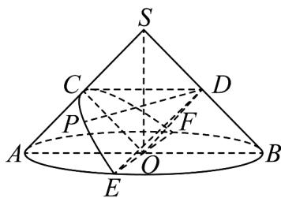
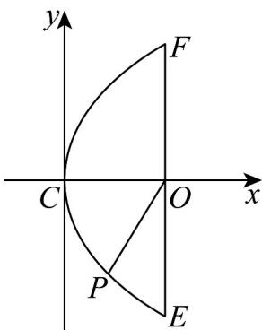

> [!faq]- 《专题12_抛物线标准方程及其性质全方位总结_八大题型__高效培优期中专》官方解析
>
> > [!success]- **【答案】** $\left[1, \frac{\sqrt{6}}{2}\right]$
>
> > [!note]- **【分析】**
> > 勾股得到 $\left|DC\right|=\sqrt{2}$ ，从而得到 $\frac{\left|DP\right|}{\left|DC\right|}=\frac{\left|DP\right|}{\sqrt{2}}$ ，然后根据 $SA\perp$ 截面得到截面，根据勾股得到当 $\left|OP\right|$ 范围， $DP=\sqrt{OD^{2}+OP^{2}}=\sqrt{1+OP^{2}}$ ，再结合截面得到 $\left|OP\right|$ 的范围，从而得到 $\frac{\left|DP\right|}{\left|DC\right|}$ 的最大值.
>
> > [!note]- **【解析】**
> > 
> >
> > 过点 $O$ 作 $EF \perp AB$ ，交底面圆于 $E, F$ 两点，连接 $SO$ ， $DO$ ， $CO$
> >
> > 设 $\left|SA\right|=\left|SB\right|=2$ ，则 $\left|DC\right|=\frac{1}{2}\left|AB\right|=\sqrt{2}$
> >
> > 由圆锥的性质得 $SO \perp$ 底面，
> >
> > 因为 $EF \subset$ 底面，所以 $SO \perp EF$
> >
> > 又 $SO \cap AB = O$ ， $SO, AB \subset$ 平面 $SAB$ ，所以 $EF \perp$ 平面 $SAB$
> >
> > 因为 $SA \subset$ 平面 $SAB$ ，所以 $SA \perp EF$
> >
> > 因为 C, O 分别是 SA, AB 的中点，所以 $CO \parallel SB$ ，则 $CO \perp SA$
> >
> > 因为 COI EF = O，CO, EF ⊂ 平面 CEF，所以 SA ⊥ 平面 CEF，
> >
> > 则平面 $CEF$ 为截面，
> >
> > 因为 $D, O$ 为 $SB, AB$ 中点，所以 $OD \parallel SA$ ，所以 $OD \perp$ 平面 $CEF$
> >
> > 因为 $OP \subset$ 平面 $CEF$ ，所以 $OD \perp OP$ ，所以 $\left|DP\right| = \sqrt{OD^2 + OP^2} = \sqrt{1 + OP^2}$
> >
> > 如图为截面的平面图，
> >
> > 
> >
> > 以 $C$ 为原点， $CO$ 为 $x$ 轴，过点 $C$ 垂直 $CO$ 向上的方向为 $y$ 轴正方向建系，
> >
> > $\left|CO\right| = 1$ ， $\left|OE\right| = \left|OF\right| = \sqrt{2}$ ， $O(1,0)$ ，则抛物线方程为 $y^{2} = 2x$
> >
> > 设 $P\left(\frac{a^2}{2}, a\right)$ ， $a \in \left[-\sqrt{2}, \sqrt{2}\right]$ ，则 $|OP| = \sqrt{\left(1 - \frac{a^2}{2}\right)^2 + a^2} = \sqrt{\frac{a^4}{4} + 1}$ ，
> >
> > 所以 $|OP|\in\left[1,\sqrt{2}\right]$
> >
> > 则 $\left|DP\right|=\sqrt{1+OP^{2}}\in\left[\sqrt{2},\sqrt{3}\right]$ ，所以 $\frac{\left|DP\right|}{\left|DC\right|}=\frac{\left|DP\right|}{\sqrt{2}}=\left[1,\frac{\sqrt{6}}{2}\right]$ .
> >
> > 故答案为： $\left[1,\frac{\sqrt{6}}{2}\right]$
