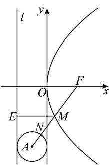

> [!faq]- 《专题12_抛物线标准方程及其性质全方位总结_八大题型__高效培优期中专》官方解析
>
> > [!success]- **【答案】** B
>
> > [!note]- **【分析】**
> > 作出图形，过点 $M$ 作 $ME$ 垂直于抛物线的准线，垂足为点 $E$ ，利用抛物线的定义可知 $d = |MF| - 2$ 分析可知，当且仅当 $N, M$ 为线段 $AF$ 分别与圆 $A$ 、抛物线 $C$ 的交点时， $|MN| + d$ 取最小值，即可得解
>
> > [!note]- **【解析】**
> > 根据已知得到 $F(2,0)$ ，圆 $A:(x+1)^{2}+(y+4)^{2}=1$
> >
> > 所以 $A(-1,-4)$ ，圆 A 的半径为 1，
> >
> > 抛物线 $C$ 的准线为 $l: x = -2$ ，过点 $M$ 作 $ME \perp l$ ，垂足为点 $E$ ，则 $\left|ME\right| = d + 2$
> >
> > 由抛物线的定义可得 $d + 2 = |ME| = |MF|$
> >
> > 所以， $\left|MN\right|+d=\left|MN\right|+\left|MF\right|-2\quad\left|AM\right|+\left|MF\right|-1-2$
> >
> > $= \sqrt{(2 + 1)^{2} + (-4)^{2}} - 1 - 2 = 2.$
> >
> > 当且仅当 N、M 为线段 AF 分别与圆 A、抛物线 C 的交点时，两个等号成立，
> >
> > 因此， $\left|MN\right|+d$ 的最小值为 2.
> >
> > 故选：B.
> >
> > 
