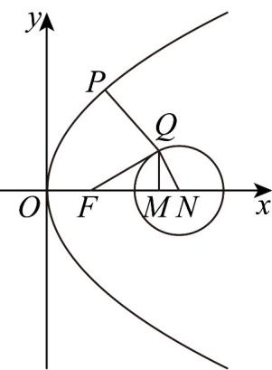

> [!faq]- 《专题12_抛物线标准方程及其性质全方位总结_八大题型__高效培优期中专》官方解析
>
> > [!success]- **【答案】** $4 \sqrt{6}$
>
> > [!note]- **【分析】**
> > 取点 $M(5,0)$ ，根据相似三角形得 $|QF|=2|QM|$ ，则 $|PQ|+|QM||PM|$ ，再通过设点 $P\left(\frac{y_0^2}{8},y_0\right)$
> >
> > 结合两点距离公式和二次函数性质即可求出最小值·
>
> > [!note]- **【解析】**
> > 由题意得 $F(2,0)$ ，取点 $M(5,0)$ ，设圆 $(x-6)^{2}+y^{2}=4$ 的圆心为N，
> >
> > 则 $MN = 1$ ，所以 $\frac{MN}{QN} = \frac{QN}{FN} = \frac{1}{2}$ ，又因为 $\angle QNM = \angle FNQ$
> >
> > 所以 $\triangle QNM \sim \triangle FNQ$ ，则 $|QF| = 2 |QM|$ ，
> >
> > $$
> > \therefore 2 | P Q | + | Q F | = 2 (| P Q | + | Q M |)
> > $$
> >
> > $\because |PQ|+|QM||PM|$ ，即求PM得最小值，
> >
> > 设 $P\left(\frac{y_0^2}{8}, y_0\right)$ ，则 $\left|PM\right| = \sqrt{\left(\frac{y_0^2}{8} - 5\right)^2 + y_0^2}$
> >
> > 令 $y_0^2 = t(t - 0),\therefore |PM|^2 = \left(\frac{t}{8} -5\right)^2 +t = \frac{t^2}{64} -\frac{t}{4} +25.$
> >
> > 当 $t = 8$ 时， $|PM| = 2\sqrt{6}$ ，即 $2|PQ| + |QF|$ 的最小值为 $4\sqrt{6}$ .
> >
> > 故答案为： $4\sqrt{6}$
> >
> > 
