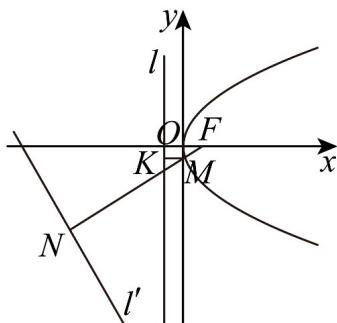

> [!faq]- 《专题12_抛物线标准方程及其性质全方位总结_八大题型__高效培优期中专》官方解析
>
> > [!success]- **【答案】** D
>
> > [!note]- **【分析】**
> > 利用抛物线的定义得到 $d_{1}=\left|MF\right|$ ，从而 $d_{1}+d_{2}=\left|MF\right|+\left|MN\right|$ ，结合图形，可知当M,N,F三点共线，且M在N,F中间时， $d_{1}+d_{2}$ 取得最小值，利用点到直线的距离计算即得
>
> > [!note]- **【解析】**
> > 设抛物线 $C: y^{2} = 4x$ 的焦点为 F，由抛物线的定义可知 $d_{1} = \left|MF\right|$ .
> > 如图，设 $MN \perp l'$ 于点 N，则 $d_{1} + d_{2} = \left|MF\right| + \left|MN\right|$ 由图可知，当 M, N, F 三点共线，且 M 在 N, F 中间时， $d_{1} + d_{2}$ 取得最小值。
> > 由抛物线 $C: y^{2} = 4x$ ，得 $F(1,0)$ ，
> > 所以 $d_{1} + d_{2}$ 的最小值即点到直线 $l': \sqrt{3}x + y + 9\sqrt{3} = 0$ 的距离，为 $\frac{\left|\sqrt{3} + 0 + 9\sqrt{3}\right|}{\sqrt{3 + 1}} = 5\sqrt{3}$
> >
> > 故选：D
> >
> > 
