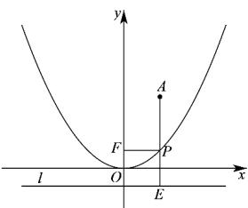

> [!faq]- 《专题12_抛物线标准方程及其性质全方位总结_八大题型__高效培优期中专》官方解析
>
> > [!success]- **【答案】** $\frac{5}{2}$
>
> > [!note]- **【分析】**
> > 过点 $P$ 作 $PE \perp l$ ，垂足为点 $E$ ，由抛物线的定义可得 $\left|PF\right| = \left|PE\right|$ ，结合图形可知，当 $A$ 、 $P$ 、 $E$ 三点共线时，即当 $AE \perp l$ 时， $\left|PA\right| + \left|PE\right|$ 取最小值，即可得解·
>
> > [!note]- **【解析】**
> > 易知抛物线 $C$ 的焦点为 $F\left(0, \frac{1}{2}\right)$ ，准线为 $l: y = -\frac{1}{2}$ ，
> >
> > 过点 $P$ 作 $PE \perp l$ ，垂足为点 $E$ ，如下图所示：
> >
> > 
> >
> > 由抛物线的定义可得 $\left|PF\right|=\left|PE\right|$ ，则 $\left|PA\right|+\left|PF\right|=\left|PA\right|+\left|PE\right|$ ，
> >
> > 结合图形可知，当 $A, P, E$ 三点共线时，即当 $AE \perp l$ 时， $\left|PA\right| + \left|PE\right|$ 取最小值，
> >
> > 且最小值为 $2 + \frac{1}{2} = \frac{5}{2}$ ，因此， $|PF| + |PA|$ 的最小值为 $\frac{5}{2}$ .
> >
> > 故答案为： $\frac{5}{2}$
