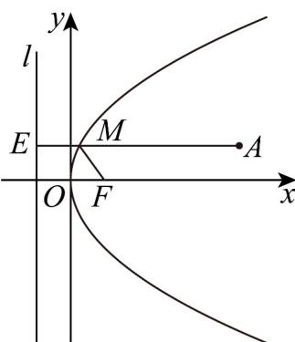

> [!faq]- 《专题12_抛物线标准方程及其性质全方位总结_八大题型__高效培优期中专》官方解析
>
> > [!success]- **【答案】** 6
>
> > [!note]- **【分析】**
> > 过点 $M$ 作抛物线 $C$ 的准线 $l$ 的垂线段，垂足点为 $E$ ，由抛物线的定义可得 $\left|MA\right| + \left|MF\right| = \left|MA\right| + \left|ME\right|$ 分析可知，当且仅当 $A$ 、 $M$ 、 $E$ 三点共线时， $\left|MA\right| + \left|MF\right|$ 取最小值，即可得解·
>
> > [!note]- **【解析】**
> > 过点 $M$ 作抛物线 $C$ 的准线 $l$ 的垂线段，垂足点为 $E$ ，如下图所示：
> >
> > 
> >
> > 易知，抛物线 C 的焦点为 $F(1,0)$ ，准线为 l:x=-1，
> >
> > 由抛物线的定义可得 $\left|MF\right| = \left|ME\right|$ ，所以， $\left|MA\right| + \left|MF\right| = \left|MA\right| + \left|ME\right|$
> >
> > 当且仅当 A、M、E 三点共线时，即当 $AE \perp l$ 时， $\left|MA\right| + \left|MF\right|$ 取最小值，且最小值为 $5 + 1 = 6 \cdot$
> >
> > 故答案为：6.
