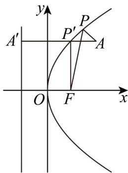

> [!faq]- 《专题12_抛物线标准方程及其性质全方位总结_八大题型__高效培优期中专》官方解析
>
> > [!success]- **【答案】** 6
>
> > [!note]- **【分析】**
> > 过 A 作准线 x = -2 的垂线垂足为 $A'$ ，交抛物线于 $P'$ ，根据抛物线的定义可得，当 P、 $A'$ 、A 三点共线时， $|PA| + |PF|$ 小值。
>
> > [!note]- **【解析】**
> > 抛物线 $y^{2}=8x$ ，所以焦点为 $F(2,0)$ ，准线方程为 x=-2，
> >
> > 当 $x = 4$ 时 $y^{2} = 8 \times 4 = 32$ ，所以 $y = \pm 4\sqrt{2}$ ，因为 $\left|\pm 4\sqrt{2}\right| > 4$ ，所以点 $A$ 在抛物线内部，如图，
> >
> > 
> >
> > 过 A 作准线 x = -2 的垂线垂足为 $A'$ ，交抛物线于 $P'$
> >
> > 由抛物线的定义，可知 $|P'F|=|P'A'|$
> >
> > 故 $|PA| + |PF| \mid P'A| + |P'A'| = |AA'| = 4 - (-2) = 6$
> >
> > 即当 P 、 $A'$ 、 A 三点共线时，距离之和最小值为 6 .
> >
> > 故答案为：6。
