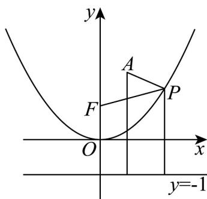

> [!faq]- 《专题12_抛物线标准方程及其性质全方位总结_八大题型__高效培优期中专》官方解析
>
> > [!success]- **【答案】** (1)(0,1)，准线方程为 y = -1. (2)3
>
> > [!note]- **【分析】**
> > （1）根据抛物线方程求得焦点坐标以及准线方程·
> >
> > (2) 根据抛物线的定义求得正确答案.
>
> > [!note]- **【解析】**
> > （1）将抛物线 $C:y = \frac{1}{4} x^2$ 化为标准方程得， $x^{2} = 4y$
> >
> > 其焦点坐标为 $(0,1)$ ，准线方程为y=-1。
> >
> > (2) 由抛物线的定义知，点 P 到焦点 F 的距离即为点 P 到准线的距离，
> >
> > $\left|PA\right| + \left|PF\right|$ 为点 $P$ 到定点 $A(1,2)$ 的距离与点 $P$ 到准线的距离之和，
> >
> > 要使得 $\left|PA\right|+\left|PF\right|$ 最小，
> >
> > 则点 P, A 在一条垂直于准线的直线上，故最小值即为点 $A(1,2)$ 到准线 y = -1 的距离为 3，
> > 所以， $\left|PA\right|+\left|PF\right|$ 的最小值为 3.
> >
> > 
