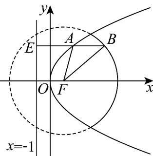

> [!faq]- 《专题12_抛物线标准方程及其性质全方位总结_八大题型__高效培优期中专》官方解析
>
> > [!success]- **【答案】** D
>
> > [!note]- **【分析】**
> > 过点 A 作准线 x = -1 的垂线，垂足为 E，则 $\triangle FAB$ 的周长为 $x_{B} + 5$ ，求出 $x_{B}$ 后可得所求的范围。
>
> > [!note]- **【解析】**
> > 
> >
> > 过点 A 作准线 x = -1 的垂线，垂足为 E ，
> >
> > 则 $\triangle FAB$ 的周长为 $|AF| + |AB| + |BF| = |AB| + |AE| + 4 = |BE| + 4 = x_B + 5$
> >
> > 由 $\left\{\begin{aligned}y^{2}&=4x\\ (x-1)^{2}+y^{2}&=16\end{aligned}\right.$ 可得 $\left\{\begin{aligned}x&=3\\ y&=\pm2\sqrt{3}\end{aligned}\right.$
> >
> > 故 $3 < x_{B} < 5$ ，故 $\triangle FAB$ 的周长的取值范围为 $(8,10)$
> >
> > 故选 **D**.
