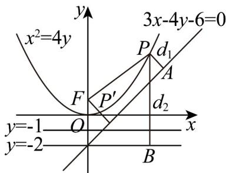

> [!faq]- 《专题12_抛物线标准方程及其性质全方位总结_八大题型__高效培优期中专》官方解析
>
> > [!success]- **【答案】** $^{3}$
>
> > [!note]- **【分析】**
> > 求出焦点 $F(0,1)$ ，准线 $l:y = -1$ ，作出辅助线，设动点 $P$ 直线 $l,l_1,l_2$ 的距离分别为 $d,d_1,d_2$ ，求出点 $F$ 到直线 $l_1$ 的距离为 $d_3 = 2$ ，由抛物线定义得到 $d_2 = d + 1 = |PF| + 1$ ，进而得到 $d_1 + d_2 = d_1 + |PF| + 1\quad d_3 + 1 = 3$ 。
>
> > [!note]- **【解析】**
> > 由题意可得：抛物线 $x^{2} = 4y$ 的焦点 $F(0,1)$ ，准线 $l:y = -1$ ，设动点 $P$ 直线 $l,l_1,l_2$ 的距离分别为 $d,d_1,d_2$ ，点 $F$ 到直线 $l_1$ 的距离为 $d_{3} = \frac{|3\times 0 - 4\times 1 - 6|}{\sqrt{3^2 + (-4)^2}} = 2$ ，则 $d_{2} = d + 1 = |PF| + 1$ ，可得 $d_{1} + d_{2} = d_{1} + |PF| + 1$ ， $d_{3} + 1 = 3$ ，当且仅当点 $P$ 在点 $F$ 到直线 $l_1$ 的垂线上且 $P$ 在 $F$ 与 $l_1$ 之间时，即 $P'$ 时，等号成立，动点 $P$ 到直线 $l_1$ 直线 $l_2$ 的距离之和的最小值是3.
> >
> > 
> >
> > 故答案为：3
