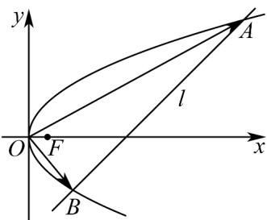

> [!faq]- 《专题12_抛物线标准方程及其性质全方位总结_八大题型__高效培优期中专》官方解析
>
> > [!success]- **【答案】** (1) $y^{2}=4x$ (2)6
>
> > [!note]- **【分析】**
> > （1）根据条件，利用焦半径公式，得 $MF = 2 + \frac{p}{2} = 3$ ，即可求解；
> >
> > (2) 设 $A(x_{1}, y_{1}), B(x_{2}, y_{2})$ ，联立直线与抛物线方程，结合条件，利用根与系数间的关系，得 $t^{2} - 4t - 12 = 0$ ，即可求解。
>
> > [!note]- **【解析】**
> > （1）因为抛物线上点 $M(2,n)$ 到焦点 $F$ 的距离为3，所以 $MF = 2 + \frac{p}{2} = 3$
> >
> > 解得 p=2 ，所以抛物线的方程为 $y^{2}=4x$ .
> >
> > (2) 设 $A(x_{1}, y_{1}), B(x_{2}, y_{2})$ ，由 $\left\{\begin{aligned} y^{2} &= 4x \\ x &= y + t \end{aligned}\right.$ ，消 x 得到 $y^{2} - 4y - 4t = 0$ ，
> >
> > 因为 $t > 0$ ，所以 $\Delta = 16 + 16t > 0$ ，且 $y_{1} + y_{2} = 4, y_{1}y_{2} = -4t$
> >
> > 所以 $x_{1}x_{2}=(y_{1}+t)(y_{2}+t)=y_{1}y_{2}+t(y_{1}+y_{2})+t^{2}=-4t+4t+t^{2}=t^{2}$
> >
> > 又 $\overline{OA}=(x_{1},y_{1}),\overline{OB}=(x_{2},y_{2})$ ，则 $\overline{OA}\cdot\overline{OB}=x_{1}x_{2}+y_{1}y_{2}=-4t+t^{2}=12$ ，即 $t^{2}-4t-12=0$
> >
> > 解得 t = 6 或 t = -2 ，又因为 t > 0 ，所以 t = 6 .
> >
> > 
