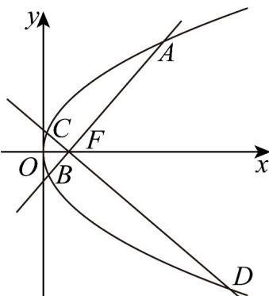

> [!faq]- 《专题12_抛物线标准方程及其性质全方位总结_八大题型__高效培优期中专》官方解析
>
> > [!success]- **【答案】** (1) $y^{2}=4x$ (2) $\sqrt{5}$ (3)128
>
> > [!note]- **【分析】**
> > （ $^{1}$ ）先判断曲线 $\Gamma$ 的类型，再确定其解析式.
> >
> > (2) 根据抛物线的焦点弦公式求弦长，点到直线的距离求高，可求出三角形的面积.
> >
> > (3) 根据焦点弦公式分别求弦长 $\left|AB\right|$ 和 $\left|DE\right|$ ，再结合基本不等式和换元法求 $\left|AB\right|^{2} + \left|DE\right|^{2}$ 的最小值.
>
> > [!note]- **【解析】**
> > （1）由题意：曲线 $\Gamma$ 上的点到点 $F(1,0)$ 的距离与到直线 $x = -1$ 的距离相等，
> >
> > 所以曲线 $\Gamma$ 为抛物线，且 $F(1,0)$ 为焦点， $x = -1$ 为准线，所以 $p = 2$ 。
> >
> > 所以曲线 $\Gamma$ 的方程为： $y^{2} = 4x$ 。
> >
> > (2) 直线 MN 方程为： $y = -2(x - 1)$ ，代入 $y^{2} = 4x$
> >
> > 整理得： $x^{2} - 3x + 1 = 0$
> >
> > 由韦达定理得： $x_{M} + x_{N} = 3$ .
> >
> > 所以 $\left|MN\right|=x_{M}+x_{N}+p=3+2=5$
> >
> > 又点 $O$ 到直线 $MN: 2x + y - 2 = 0$ 的距离为： $d = \frac{|-2|}{\sqrt{2^2 + 1^2}} = \frac{2\sqrt{5}}{5}$ .
> >
> > 所以 $S_{\triangle OMB} = \frac{1}{2} \times 5 \times \frac{2\sqrt{5}}{5} = \sqrt{5}$ .
> >
> > (3) 如图：
> >
> > 
> >
> > 设直线 $l_{1}: y = k(x - 1)$ ，代入抛物线 $y^{2} = 4x$ 得： $k^{2}(x - 1)^{2} = 4x$
> >
> > 整理得： $k^{2}x^{2}-\left(2k^{2}+4\right)x+k^{2}=0$
> >
> > 由韦达定理： $x_{A}+x_{B}=\frac{2k^{2}+4}{k^{2}}$
> >
> > 所以 $\left|AB\right|=x_{A}+x_{B}+p=\frac{2k^{2}+4}{k^{2}}+2=4\left(1+\frac{1}{k^{2}}\right)$ .
> >
> > 用 $-\frac{1}{k}$ 代替 $k$ ，可得 $\left|CD\right| = 4\left(1 + k^2\right)\cdot$
> >
> > $$
> > \text {以} \left| A B \right| ^ {2} + \left| C D \right| ^ {2} = 1 6 \left[ \left(1 + \frac {1}{k ^ {2}}\right) ^ {2} + \left(1 + k ^ {2}\right) ^ {2} \right] = 1 6 \left[ \left(k ^ {2} + \frac {1}{k ^ {2}}\right) ^ {2} + 2 \left(k ^ {2} + \frac {1}{k ^ {2}}\right) \right]
> > $$
> >
> > 设 $k^2 + \frac{1}{k^2} = t$ ，则 $t = 2$ ，当且仅当 $k^2 = 1$ 时取“=”.
> >
> > 则 $\left|AB\right|^{2}+\left|CD\right|^{2}=16(t^{2}+2t)=16\left[\left(t+1\right)^{2}-1\right]$ $16\left(3^{2}-1\right)=128\cdot$
