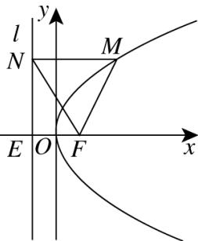

> [!faq]- 《专题12_抛物线标准方程及其性质全方位总结_八大题型__高效培优期中专》官方解析
>
> > [!success]- **【答案】** 6
>
> > [!note]- **【分析】**
> > 通过作辅助线，利用角度关系和抛物线定义构造等边三角形和直角三角形，进而求出 $\left|FM\right|$ .
>
> > [!note]- **【解析】**
> > 过点M作抛物线准线l的垂线，垂足为点N，连接FN，如图所示
> > 因为 $\angle OFM = 120^{\circ}, MN // x$ 轴，则 $\angle FMN = 60^{\circ}$ ，由抛物线的定义可得 $\left|MN\right| = \left|FM\right|$ ，
> > 所以 $\triangle FNM$ 为等边三角形，则 $\angle FNM = 60^{\circ}$ ，抛物线 $y^{2} = 6x$ 的准线方程为 $x = -\frac{3}{2}$ ，
> > 设准线 $x = -\frac{3}{2}$ 交 x 轴于点 E，则 $\angle ENF = 30^{\circ}$ ，易知 $\left|EF\right| = 3, \angle FEN = 90^{\circ}$ ，则 $\left|FM\right| = \left|FN\right| = 2\left|EF\right| = 6\cdot$ 故答案为：6.
> >
> > 
