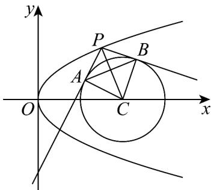

> [!faq]- 《专题12_抛物线标准方程及其性质全方位总结_八大题型__高效培优期中专》官方解析
>
> > [!success]- **【答案】** 9
>
> > [!note]- **【分析】**
> > 根据给定条件，求出点 P 的纵坐标，再利用抛物线的定义列式求解.
>
> > [!note]- **【解析】**
> > 抛物线 $C: x^{2} = 2my$ 的准线为 $y = -\frac{m}{2}$
> >
> > 由点 P 到 y 轴的距离为 $^{3}$ ，得点 P 的纵坐标 $y_{P} = \frac{9}{2m}$ ，
> >
> > 由点 $P$ 到 $C$ 的焦点的距离为5，得 $\frac{9}{2m} +\frac{m}{2} = 5$ ，解得 $m = 1$ 或 $m = 9$ ，而 $m > 2$
> >
> > 所以 m = 9.
> >
> > 故答案为：9
> >
> > 42. 过抛物线 $y^{2} = 4x$ 上一动点 $P$ 作圆 $C: (x - 4)^{2} + y^{2} = r^{2} (r > 0)$ 的两条切线，切点分别为 $A, B$ ，若 $|AB| \cdot |PC|$ 的最小值是12，则 $r =$ \_\_\_\_.
> >
> > 【答案】 $\sqrt{6}$
> >
> > 【分析】设 $P(x_0, y_0)$ ，利用圆的切线性质，借助图形的面积把 $|AB| \cdot |PC|$ 表示为 $x_0$ 的函数，再求出函数的最小值即可·
> >
> > 【详解】设 $P(x_{0}, y_{0})$ ，则 $y_{0}^{2} = 4x_{0}$ ，圆 C 的圆心 $C(4, 0)$ ，半径为 r，
> >
> > 由 $PA, PB$ 切圆 $C$ 于点 $A, B$ ，得 $PC \perp AB, PA \perp AC, PB \perp BC$
> >
> > 
> >
> > $$
> > \left| A B \right| \cdot \left| P C \right| = 2 S _ {\text {四边形} P A C B} = 4 S _ {\mathrm{VPAC}} = 2 \left| P A \right| \cdot \left| A C \right| = 2 r \sqrt {\left| P C \right| ^ {2} - r ^ {2}} = 2 r \sqrt {\left(x _ {0} - 4\right) ^ {2} + y _ {0} ^ {2} - r ^ {2}}
> > $$
> >
> > $$
> > = 2 r \sqrt {x _ {0} ^ {2} - 4 x _ {0} + 1 6 - r ^ {2}} = 2 r \sqrt {\left(x _ {0} - 2\right) ^ {2} + 1 2 - r ^ {2}} \quad 2 r \sqrt {1 2 - r ^ {2}}
> > $$
> >
> > 当且仅当 $x_0 = 2$ 时，等号成立，
> >
> > 可知 $\left|AB\right|\cdot\left|PC\right|$ 的最小值为 $2r\sqrt{12-r^{2}}=12$ ，
> >
> > 整理可得 $r^{4}-12r^{2}+36=0$ ，解得 $r^{2}=6$ ，
> >
> > 且 r > 0 ，所以 $r = \sqrt{6}$ ，
> >
> > 故答案为： $\sqrt{6}$
>
> > [!tip]- **【名师点睛】**
> > 关键点点睛：根据切线的性质，将 $\left|AB\right|\cdot\left|PC\right|$ 转化为 $2S_{四边形PACB}$ ，根据面积结合几何性质求解
