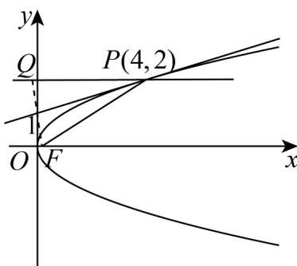

> [!faq]- 《专题12_抛物线标准方程及其性质全方位总结_八大题型__高效培优期中专》官方解析
>
> > [!success]- **【答案】** (1) $x - 4y + 4 = 0$ (2) $y = 2$
>
> > [!note]- **【分析】**
> > （1）根据抛物线 $C$ 过点 $P(4,2)$ ，求得抛物线 $C$ 的方程后，设出切线方程，直线与抛物线联立，消元后，利用 $\Delta = 0$ ，解出即可；
> >
> > (2) 根据反射关系，求出点 $F$ 关于过点 $P$ 的抛物线 $C$ 的切线方程的对称点，然后可以得到反射光线所在的直线.
>
> > [!note]- **【解析】**
> > （1）由抛物线 C： $y^{2}=2px$ 过点 $P(4,2)$ 得 $2^{2}=2p\times4$
> >
> > 解得 $p = \frac{1}{2}$ ，所以，所求抛物线 $C$ 的方程为 $y^{2} = x$ ：
> >
> > 由题可设切线方程为 $x-4=m(y-2)$
> >
> > 联立 $\left\{ \begin{array}{l} y^{2} = x \\ x - 4 = m(y - 2) \end{array} \right.$
> >
> > 消去 x 并整理得： $y^{2}-my+2m-4=0$ ，
> >
> > 令 $\Delta = m^2 - 4 \times 1 \times (2m - 4) = 0$
> >
> > 解得 m = 4 ，
> >
> > 所以，所求切线方程为 $x - 4y + 4 = 0$
> >
> > (2) 由题点 F 发出的入射光线所在的直线与反射光线所在的直线关于抛物线 C 在点 P 处的切线 l 对称，又 $F(\frac{1}{4},0)$ ,
> >
> > 设点 $F$ 关于点 $P$ 处的切线 $l$ 的对称点为 $Q(x_0, y_0)$
> >
> > 则由 的中点在 $l$ 上及 得： $\left\{ \begin{array}{l} \frac{x_0 + \frac{1}{4}}{2} - 4 \times \frac{y_0}{2} + 4 = 0 \\ \frac{y_0}{x_0 - \frac{1}{4}} = -4 \end{array} \right.$ $FQ \perp l$
> >
> > 解得 $\left\{ \begin{array}{l}x_0 = -\frac{1}{4}\\ y_0 = 2 \end{array} \right.$ ，即 $Q\left(-\frac{1}{4},2\right)$
> >
> > 所以，所求反射光线所在的直线方程为 $y = 2$
> >
> > 
