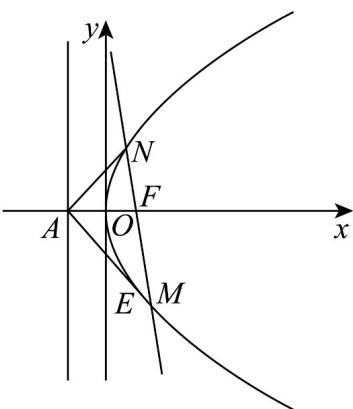

> [!faq]- 《专题12_抛物线标准方程及其性质全方位总结_八大题型__高效培优期中专》官方解析
>
> > [!success]- **【答案】** BCD
>
> > [!note]- **【分析】**
> > 设直线 l 的方程为 $x = my + \frac{p}{2}$ ， $M(x_{1}, y_{1}), N(x_{2}, y_{2})$ ，根据 $MF = \lambda FN (\lambda > 1)$ ，可得 $y_{1}, y_{2}$ 的关系，联立方程，利用韦达定理求出 $y_{1} + y_{2}, y_{1}y_{2}$ ，进而可求出 $y_{1}, y_{2}$ ，从而可求出 m，即可判断 A；求出 M 点的坐标即可判断 B；根据 $k_{AM} + k_{AN} = 0$ 是否成立即可判断 C；根据 C 选项结合抛物线的对称性即可判断 D.
>
> > [!note]- **【解析】**
> > $F\left(\frac{p}{2},0\right),A\left(-\frac{p}{2},0\right)$
> >
> > 设直线 $l$ 的方程为 $x = my + \frac{p}{2}$ ， $M(x_1, y_1), N(x_2, y_2)$
> >
> > 则 $MF = \left(\frac{p}{2} - x_1, - y_1\right), FN = \left(x_2 - \frac{p}{2}, y_2\right)$
> >
> > 因为 $\overline{MF} = \lambda \overline{FN} (\lambda > 1)$ ,
> >
> > 所以 $\left\{ \begin{array}{l} \frac{p}{2} - x_1 = \lambda \left( x_2 - \frac{p}{2} \right) \\ -y_1 = \lambda y_2 \end{array} \right.$ ，所以 $\left\{ \begin{array}{l} x_1 = (1 + \lambda) \frac{p}{2} - \lambda x_2 \\ y_1 = -\lambda y_2 \end{array} \right.$ ，
> >
> > 联立 $\left\{\begin{aligned}x&=my+\frac{p}{2}\\ y^{2}&=2px\end{aligned}\right.$ 得 $y^{2}-2pmy-p^{2}=0$
> >
> > 则 $y_{1} + y_{2} = 2pm, y_{1}y_{2} = -p^{2}$
> >
> > 所以 $y_{1} + y_{2} = (1 - \lambda)y_{2} = 2pm$ ，所以 $y_{2} = \frac{2pm}{1 - \lambda}, y_{1} = -\frac{2pm\lambda}{1 - \lambda}$ ，
> >
> > 所以 $y_{1}y_{2}=-\frac{2pm\lambda}{1-\lambda}\cdot\frac{2pm}{1-\lambda}=-p^{2}$ ，解得 $\frac{1}{m}=\pm\frac{2\sqrt{\lambda}}{\lambda-1}$ ，
> >
> > 即直线 l 的斜率为 $\pm\frac{2\sqrt{\lambda}}{\lambda-1}$ ，故 A 错误；
> >
> > 由 $y_{1} = -\frac{2pm\lambda}{1 - \lambda}$ ，得 $x_{1} = \frac{y_{1}^{2}}{2p} = \frac{\frac{4p^{2}m^{2}\lambda^{2}}{(1 - \lambda)^{2}}}{2p} = \frac{2pm^{2}\lambda^{2}}{(1 - \lambda)^{2}} = \frac{2p\lambda^{2}\cdot\frac{(\lambda - 1)^{2}}{4\lambda}}{(1 - \lambda)^{2}} = \frac{p\lambda}{2}$
> >
> > 由 $\frac{1}{m} = \pm \frac{2\sqrt{\lambda}}{\lambda - 1}$ ，得 $y_{1} = -\frac{2p\lambda}{1 - \lambda}\cdot \left(\pm \frac{\lambda - 1}{2\sqrt{\lambda}}\right) = \pm p\sqrt{\lambda}$ ，
> >
> > 即 $M\left(\frac{p\lambda}{2}, \pm p\sqrt{\lambda}\right)$
> >
> > 所以 $k_{MA}=\frac{\pm p\sqrt{\lambda}}{\frac{p\lambda}{2}+\frac{p}{2}}=\pm\frac{2\sqrt{\lambda}}{\lambda+1}$ ， $\tan\angle MAF=\frac{2\sqrt{\lambda}}{\lambda+1}$ ，故 B 正确；
> >
> > $$
> > k _ {A M} + k _ {A N} = \frac {y _ {1}}{x _ {1} + \frac {p}{2}} + \frac {y _ {2}}{x _ {2} + \frac {p}{2}} = \frac {y _ {1}}{m y _ {1} + p} + \frac {y _ {2}}{m y _ {2} + p}
> > $$
> >
> > $$
> > = \frac {2 m y _ {1} y _ {2} + p (y _ {1} + y _ {2})}{(m y _ {1} + p) (m y _ {2} + p)} = \frac {- 2 m p ^ {2} + 2 m p ^ {2}}{(m y _ {1} + p) (m y _ {2} + p)} = 0
> > $$
> >
> > 所以 $k_{AM} = -k_{AN}$
> >
> > 所以直线 AM, AN 关于 x 轴对称，
> >
> > 所以 $\angle MAF = \angle NAF$ ，故 C 正确；
> >
> > 由题意可得 $E, N$ 都在 $M$ 的左侧，且直线 $AM, AN$ 关于 $x$ 轴对称，
> >
> > 根据抛物线的对称性可得 $\left|AE\right|=\left|AN\right|$ ，故D正确.
> >
> > 故选：BCD.
> >
> > 
