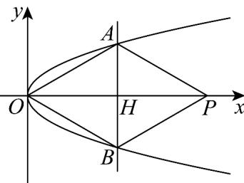

> [!faq]- 《专题12_抛物线标准方程及其性质全方位总结_八大题型__高效培优期中专》官方解析
>
> > [!success]- **【答案】** A
>
> > [!note]- **【分析】**
> > 线段 OP 的垂直平分线 l 交 C 于 A, B 两点，结合抛物线的对称性可得 AB 与 OP 互相平分，则四边形 OAPB 为菱形，可设 P 点坐标，通过几何关系求出 A 点坐标，在代入抛物线方程即可求解。
>
> > [!note]- **【解析】**
> > 因为线段 OP 的垂直平分线 l 交 C 于 A, B 两点，
> >
> > 所以结合抛物线的对称性可得 $AB$ 与 $OP$ 互相平分, 则四边形 $OAPB$ 为菱形.
> >
> > 设点 $P(2t,0)$ 且 $t > 0$ 则线段 $OP$ 的垂直平分线 $l$ 方程为 $x = t$
> >
> > 令 $l$ 与 $x$ 轴交于点 $H$ ，又 $\angle OAP = 120^{\circ}$
> >
> > 
> >
> > 则在直角三角形 $OAH$ 中 $\angle OAH = \frac{1}{2}\angle OAP = 60^{\circ}$
> >
> > 继而可得 $\left|AH\right|=\frac{\left|OH\right|}{\sqrt{3}}=\frac{\sqrt{3}t}{3}$ ，
> >
> > 所以 A 点坐标为 $\left(t, \frac{\sqrt{3}t}{3}\right)$ ,
> >
> > 代入抛物线 $C:y^{2} = 8x$ ，可得 $\frac{t^2}{3} = 8t$ ，解得 $t = 24$
> >
> > 直角三角形 $OAH$ 中 $\left|OA\right| = 2\left|AH\right| = 2\times \frac{\sqrt{3}}{3}\times 24 = 16\sqrt{3}$
> >
> > 所以四边形OAPB的周长为 $4|OA| = 64\sqrt{3}$
> >
> > 故选：A.
> >
> > 考点07 直线与抛物线联立问题
