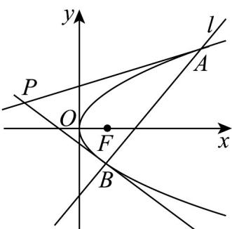

> [!faq]- 《专题12_抛物线标准方程及其性质全方位总结_八大题型__高效培优期中专》官方解析
>
> > [!success]- **【答案】** (1) $y^{2}=4x$ (2)① $4 \sqrt{3}$ ; ②证明见解析
>
> > [!note]- **【分析】**
> > （1）设抛物线的标准方程为 $y^{2} = 2px(p > 0)$ ，根据点 $(2, -2\sqrt{2})$ 在抛物线上，求得 $p = 2$ ，即可求得抛物线 $C$ 的标准方程；
> >
> > (2) ①由 $l: y = x - 2$ ，联立方程组得到 $x_{1} + x_{2} = 8$ 和 $x_{1}x_{2} = 4$ ，利用弦长公式和点到直线的距离公式，结合三角形的面积公式，即可求解；
> >
> > ②联立方程组，得到 $y_{1} + y_{2} = 4m$ ， $y_{1}y_{2} = -8$ ，设 $A$ 在第一象限，利用导数的几何意义，分别求得在 $A$ 和 $B$ 处的切线方程，联立方程组，求得 $x = -2$ ，即可得到答案：
>
> > [!note]- **【解析】**
> > （1）解：由题意，可设抛物线的标准方程为 $y^{2} = 2px(p > 0)$ .
> >
> > 因为点 $\left(2, -2\sqrt{2}\right)$ 在抛物线上，可得 $\left(-2\sqrt{2}\right)^2 = 2p\times 2$ ，解得 $p = 2$ ，
> >
> > 所以抛物线 C 的标准方程为 $y^{2}=4x$ .
> >
> > (2) 解：①当 m=1 时，直线 l:y=x-2
> >
> > 联立方程组 $\left\{ \begin{array}{l} y^{2} = 4x \\ y = x - 2 \end{array} \right.$ ，整理得 $x^{2} - 8x + 4 = 0$ ，
> >
> > 方程 $x^{2}-8x+4=0$ 的判别式 $\Delta=64-16=48>0$
> >
> > 设 $A(x_{1},y_{1})$ ， $B(x_{2},y_{2})$ ，则 $x_{1}+x_{2}=8$ ， $x_{1}x_{2}=4$ ，
> >
> > 所以 $\left|AB\right|=\sqrt{1+1^{2}}\sqrt{\left(x_{1}+x_{2}\right)^{2}-4x_{1}x_{2}}=\sqrt{2}\times\sqrt{64-16}=4\sqrt{6}$
> >
> > 又由 $O$ 到直线 $l: x - y - 2 = 0$ 的距离 $d = \frac{|0 - 0 - 2|}{\sqrt{1^2 + (-1)^2}} = \sqrt{2}$
> >
> > 所以 $\triangle OAB$ 的面积 $S_{\triangle OAB} = \frac{1}{2}|AB| \times d = 4\sqrt{3}$
> > - **②**：联立方程组 $\left\{ \begin{array}{l} y^{2} = 4x \\ x = my + 2 \end{array} \right.$ ，整理得 $y^{2} - 4my - 8 = 0$ ，
> >
> > 设 $A\left(x_{1},y_{1}\right)$ ， $B\left(x_{2},y_{2}\right)$ ，则 $\Delta = (-4m)^{2} + 32 > 0$ 且 $y_{1} + y_{2} = 4m$ ， $y_{1}y_{2} = -8$
> >
> > 不妨设 $A$ 在第一象限，则 $A$ 在曲线 $y = 2\sqrt{x} (x > 0)$ 上，则有 $y' = \frac{1}{\sqrt{x}}$
> >
> > 则在 $A(x_{1},y_{1})$ 处的切线方程为 $y - y_{1} = \frac{1}{\sqrt{x_1}} (x - x_1)$
> >
> > 又由 $y_{1}^{2} = 4x_{1}$ ，可得在 $_{A}$ 处的切线方程为 $y = \frac{2}{y_1} x + \frac{y_1}{2}$
> >
> > 同理可得，点 $_{B}$ 在曲线 $y = -2\sqrt{x} (x > 0)$ 上，则有 $y' = -\frac{1}{\sqrt{x}}$ ，
> >
> > 则在 $B(x_{2},y_{2})$ 处的切线方程为 $y - y_{2} = -\frac{1}{\sqrt{x_2}} (x - x_2)$ ，且 $y_{2}^{2} = 4x_{2}$
> >
> > 所以在 $B$ 处的切线方程为 $y = \frac{2}{y_2} x + \frac{y_2}{2}$
> >
> > 联立方程组 $\left\{ \begin{array}{l} y = \frac{2}{y_1} x + \frac{y_1}{2} \\ y = \frac{2}{y_2} x + \frac{y_2}{2} \end{array} \right.$ ，解得 $x = \frac{y_1y_2}{4} = -2$ ，所以点在定直线上： $P = x = -2$
> >
> > 
