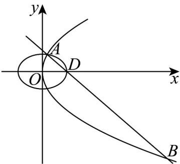

> [!faq]- 《专题12_抛物线标准方程及其性质全方位总结_八大题型__高效培优期中专》官方解析
>
> > [!success]- **【答案】** (1) $y^{2}=8x$ (2) $\left(x + \frac{1}{2}\right)^2 + y^2 = \frac{25}{4}$ (3) $|AB|=8\sqrt{5}$
>
> > [!note]- **【分析】**
> > （ $^{1}$ ）先计算求出椭圆的焦点，再结合抛物线的焦点得出抛物线方程；
> >
> > (2) 根据 CF 为直径得出圆心及半径即可得出圆的方程；
> >
> > (3) 先联立方程组，再应用弦长公式计算求解.
>
> > [!note]- **【解析】**
> > （1）因为 $9 - 5 = 4$ ，所以 $N$ 的右焦点坐标为 $(2,0)$
> >
> > 所以 $\frac{p}{2} = 2$ ，即 $p = 4$ ，
> >
> > 所以 M 的方程为 $y^{2}=8x$
> >
> > (2) 依题意得 C 的坐标为 $(-3,0)$ ,
> >
> > 所以线段 $CF$ 的中点坐标为 $\left(-\frac{1}{2},0\right)$
> >
> > 因为以 CF 为直径的圆的半径 $R = \frac{|CF|}{2} = \frac{5}{2}$ ，所以以 $CF$ 为直径的圆的标准方程为 $\left(x + \frac{1}{2}\right)^2 + y^2 = \frac{25}{4}$ （3）依题意可得直线 $l$ 的方程为 $y = -x + 3$ 由 $\left\{ \begin{array}{l} y = -x + 3, \\ y^2 = 8x, \end{array} \right.$ 得 $x^2 - 14x + 9 = 0$ 设 $A(x_1, y_1)$ ， $B(x_2, y_2)$ ，则 $\Delta = 14^2 - 36 > 0$ ， $x_1 + x_2 = 14$ ， $x_1x_2 = 9$ ，则 $|AB| = \sqrt{1 + k^2} |x_1 - x_2| = \sqrt{2} \cdot \sqrt{(x_1 + x_2)^2 - 4x_1x_2} = \sqrt{2} \times \sqrt{160} = 8\sqrt{5}$ .
> >
> > 
