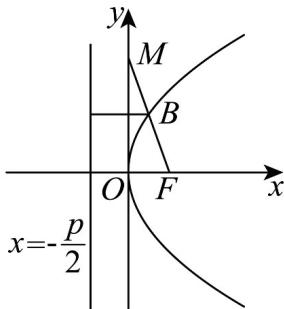

> [!faq]- 《专题12_抛物线标准方程及其性质全方位总结_八大题型__高效培优期中专》官方解析
>
> > [!success]- **【答案】** AB
>
> > [!note]- **【分析】**
> > 由题意得焦点为 $F\left(\frac{p}{2},0\right)$ ，准线为 $x=-\frac{p}{2}$ ，设 $B$ 的坐标为 $(m,n)$ ，由中点坐标公式得 $m=\frac{p}{4}$ ， $n=\frac{y_{M}}{2}$ ，即 $y_{M}=2n \cdot$ 由点 $B$ 到抛物线准线的距离为 $\frac{3\sqrt{2}}{4}$ ，得 $\frac{p}{4}-\left(-\frac{p}{2}\right)=\frac{3\sqrt{2}}{4}$ ，解得 $p=\sqrt{2} \cdot$ 即可判断选项 $^{A}$ ；故抛物线方程为 $y^{2}=2\sqrt{2}x$ ， $m=\frac{\sqrt{2}}{4}$ ，则 $n^{2}=2\sqrt{2},\frac{\sqrt{2}}{4}$ ，求出 $n$ 和 $y_{M}$ 的值，即可判断选项 $^{B}$ ；根据三角形面积公式即可判断选项 $^{C}$ ；根据直线的点斜式方程化简即可判断选项 $^{D}$ 。
>
> > [!note]- **【解析】**
> > 如图，由题意得焦点为 $F\left(\frac{p}{2},0\right)$ ，准线为 $x=-\frac{p}{2}$ ，设 $B$ 的坐标为 $(m,n)$ ，由 $B$ 为 $FM$ 的中点得 $m=\frac{0+\frac{p}{2}}{2}=\frac{p}{4}$ ， $n=\frac{y_{M}+0}{2}$ ，即 $y_{M}=2n \cdot$ 由点到抛物线准线的距离为 $\frac{3\sqrt{2}}{4}$ ，得 $\frac{p}{4}-\left(-\frac{p}{2}\right)=\frac{3\sqrt{2}}{4}$ ，解得 $p=\sqrt{2} \cdot$ 故选项 $^{A}$ 正确；
> >
> > 
> >
> > 由选项 A 知抛物线方程为 $y^{2}=2\sqrt{2}x$ ， $m=\frac{\sqrt{2}}{4}$ ，则 $n^{2}=2\sqrt{2}$ ， $\frac{\sqrt{2}}{4}$ ，故 $n=\pm1$ ， $y_{M}=\pm2$ ，所以点 M 的坐标为 $(0,2)$ 或 $(0,-2)$ 。故选项 B 正确；
> >
> > △ MOF 的面积为 $\frac{1}{2}\left|y_{M}\right|\left|OF\right|=\frac{1}{2}\times2\times\frac{\sqrt{2}}{2}=\frac{\sqrt{2}}{2}$ ·故选项 C 不正确；
> >
> > 由 $F\left(\frac{\sqrt{2}}{2},0\right)$ ， $M(0,2)$ 或 $M(0, - 2)$ 知，直线 ${}_{MF}$ 的方程为 $y - 0 = \pm 2\sqrt{2}\left(x - \frac{\sqrt{2}}{2}\right)$ ，即 $2\sqrt{2} x\pm y - 2 = 0$ ·故选项D不正确·
> >
> > 故选 **AB**.
