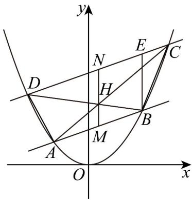

> [!faq]- 《专题12_抛物线标准方程及其性质全方位总结_八大题型__高效培优期中专》官方解析
>
> > [!success]- **【答案】** (1) $x^{2} = 4y$ (2) (i) 证明见解析；(ii) $^{18}$
>
> > [!note]- **【分析】**
> > （ $^{1}$ ）根据题意可知动点P的轨迹为抛物线，即可求解；
> >
> > (2) (i) 写出直线 $AB$ ， $CD$ 的方程，利用 $l_1 / / l_2$ 即可得到 $x_M = x_N$ ，再写出直线 $AC$ ， $BD$ 的方程，得出直线 $AC$ 与 $MN$ 的交点和直线 $BD$ 与 $MN$ 的交点重合，即为点 $H$ ，得证；(ii) 利用 $\left|HM\right| = 1$ ， $\left|HN\right| = 2$ 可得 $\left|x_2 - x_3\right| = 2$ ，可求出 $S_{\triangle BCE} = 3$ ，进而利用比例关系将四边形 $ABCD$ 的面积用 $S_{\triangle BCE}$ 表示即可求解。
>
> > [!note]- **【解析】**
> > （1）∵动点P到点 $(0,1)$ 的距离比它到直线 $y+2=0$ 的距离小1，
> >
> > ∴点P到 $(0,1)$ 的距离与到直线y=-1的距离相等，
> >
> > 则动点 $P$ 的轨迹是以 $(0,1)$ 为焦点， $y = -1$ 为准线的抛物线，
> >
> > 所以轨迹 $E$ 的方程为 $x^{2} = 4y$
> >
> > (2) (i) 设 $A(x_{1}, y_{1})$ , $B(x_{2}, y_{2})$ , $C(x_{3}, y_{3})$ , $D(x_{4}, y_{4})$ ,
> >
> > 则直线 $\frac{AB}{AB}$ 的斜率为 $k_{AB} = \frac{y_{2} - y_{1}}{x_{2} - x_{1}} = \frac{\frac{x_{2}^{2}}{4} - \frac{x_{1}^{2}}{4}}{x_{2} - x_{1}} = \frac{x_{2} + x_{1}}{4}$ ， $x_{M} = \frac{x_{2} + x_{1}}{2}$ ，
> >
> > ∴ 直线 AB 的方程为 $y - y_{1} = \frac{x_{2} + x_{1}}{4}(x - x_{1})$ ，即 $(x_{2} + x_{1})x - 4y - x_{1}x_{2} = 0$ ，
> >
> > 直线 CD 的斜率为 $k_{CD}=\frac{y_{4}-y_{3}}{x_{4}-x_{3}}=\frac{\frac{x_{4}^{2}}{4}-\frac{x_{3}^{2}}{4}}{x_{4}-x_{3}}=\frac{x_{4}+x_{3}}{4}$ ， $x_{N}=\frac{x_{4}+x_{3}}{2}$ ，
> >
> > ∴ 直线 CD 的方程为 $y - y_{3} = \frac{x_{4} + x_{3}}{4}(x - x_{3})$ ，即 $(x_{4} + x_{3})x - 4y - x_{4}x_{3} = 0$
> >
> > $Q l_{1} // l_{2}$ ， $\therefore k_{AB} = k_{CD}$ ， $\therefore \frac{x_{2} + x_{1}}{4} = \frac{x_{4} + x_{3}}{4}$ ，即 $x_{2} + x_{1} = x_{4} + x_{3}$ ，故 $x_{M} = x_{N}$
> >
> > 又直线 $\frac{AC}{AC}$ 的斜率为 $k_{AC} = \frac{y_1 - y_3}{x_1 - x_3} = \frac{\frac{x_1^2}{4} - \frac{x_3^2}{4}}{x_1 - x_3} = \frac{x_1 + x_3}{4}$ ，
> >
> > ∴ 直线 AC 的方程为 $y - y_{3} = \frac{x_{1} + x_{3}}{4}(x - x_{3})$ ，即 $(x_{1} + x_{3})x - 4y - x_{1}x_{3} = 0$ ，
> >
> > 令 $x = \frac{x_2 + x_1}{2}$ ，得 $y = \frac{x_1^2 + x_2x_1 + x_2x_3 - x_3x_1}{8} = \frac{x_4x_1 + x_2x_3}{8}$ ，
> >
> > 直线 $\frac{BD}{的斜率为}k_{BD}=\frac{y_{2}-y_{4}}{x_{2}-x_{4}}=\frac{\frac{x_{2}^{2}}{4}-\frac{x_{4}^{2}}{4}}{x_{2}-x_{4}}=\frac{x_{2}+x_{4}}{4}$
> >
> > ∴ 直线 BD 的方程为 $y - y_{2} = \frac{x_{2} + x_{4}}{4}(x - x_{2})$ ，即 $(x_{2} + x_{4})x - 4y - x_{2}x_{4} = 0$ ，
> >
> > 令 $x = \frac{x_4 + x_3}{2}$ ，得 $y = \frac{x_4^2 + x_4x_3 + x_2x_3 - x_2x_4}{8} = \frac{x_4x_1 + x_2x_3}{8}$
> >
> > 所以直线 $AC$ 与 $MN$ 的交点和直线 $BD$ 与 $MN$ 的交点重合，即为点 $H$ ：
> >
> > 所以 $M, H, N$ 三点共线；
> >
> > (ii) $\because y_{M} = \frac{y_{2} + y_{1}}{2} = \frac{x_{2}^{2} + x_{1}^{2}}{8}, y_{N} = \frac{y_{4} + y_{3}}{2} = \frac{x_{4}^{2} + x_{3}^{2}}{8}$ ,
> >
> > ∵ AB // CD，∴ $\frac{CD}{AB} = \frac{HN}{HM} > 1$ ，得 $y_{N} > y_{H} > y_{M}$ ，
> >
> > $\therefore \left|HM\right| = y_H - y_M = \frac{x_4x_1 + x_2x_3 - x_2^2 - x_1^2}{8} = 1,$
> >
> > $\left|HN\right| = y_{N} - y_{H} = \frac{x_{4}^{2} + x_{3}^{2} - x_{4}x_{1} - x_{2}x_{3}}{8} = 2,$
> >
> > 上面两式相减得 $\left(x_{4}-x_{1}\right)^{2}+\left(x_{2}-x_{3}\right)^{2}=8$ ，
> >
> > 由（i）知 $x_{2} + x_{1} = x_{4} + x_{3}$ ，即 $x_{1} - x_{4} = x_{3} - x_{2}$ ， $\therefore \left|x_2 - x_3\right| = 2$
> >
> > 过点 $B$ 作 $BE // MN$ 交 $CD$ 于点 $E$
> >
> > $\because \left|HM\right| = 1,\left|HN\right| = 2,AM = BM,BE / / MN,\therefore BE = MN = 3$
> >
> > 则 $S_{\triangle BCE} = \frac{1}{2}\times |BE|\times |x_3 - x_2| = 3$
> >
> > 又 $\frac{|AB|}{|CD|} = \frac{|MH|}{|NH|}$ ，不妨设 $CD = 4m$ ，则 $AB = 2m$
> >
> > ∵ 四边形 BMNE 是平行四边形，∴ NE = MB
> >
> > ∵ M, N 分别是 AB, CD 的中点，∴ NC = 2m ， MB = m
> >
> > $\therefore NE = m, \therefore EC = m,$
> >
> > 设 $\triangle ABH$ 的边 $AB$ 上的高为 $h_1$ ， $\triangle BCE$ 的边 $EC$ 上的高为 $h_2$ ，则 $\frac{h_1}{h_2} = \frac{1}{3}$
> >
> > $$
> > \therefore \frac {S _ {\triangle A B H}}{S _ {\triangle B C E}} = \frac {\frac {1}{2} \cdot | A B | h _ {1}}{\frac {1}{2} \cdot | E C | h _ {2}} = \frac {2 m h _ {1}}{m h _ {2}} = \frac {2}{3}, \therefore S _ {\triangle A B H} = \frac {2}{3} S _ {\triangle B C E} = 2,
> > $$
> >
> > $$
> > \therefore \frac {| A B |}{| C D |} = \frac {| M H |}{| N H |} = \frac {| A H |}{| C H |} = \frac {| B H |}{| D H |} = \frac {1}{2}
> > $$
> >
> > $$
> > \therefore S _ {\triangle C D H} = 4 S _ {\triangle A B H}, S _ {\triangle B C H} = 2 S _ {\triangle A B H}, S _ {\triangle A D H} = 2 S _ {\triangle A B H}
> > $$
> >
> > 
> >
> > $$
> > \therefore S _ {A B C D} = S _ {\triangle A B H} + S _ {\triangle A H D} + S _ {\triangle C H D} + S _ {\triangle B H C} = 9 S _ {\triangle A B H} = 9 \times 2 = 1 8
> > $$
