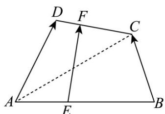
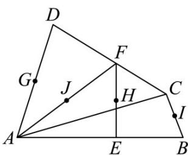

<!-- question-source:start -->
11. 如图 1，已知在空间四边形 ABCD 中，E，F 分别是 AB，CD 上的动点。

图1

图2

(1)若 $\frac{AE}{EB} = \frac{DF}{FC} = \lambda$ ，求证： $EF = \frac{\lambda}{1 + \lambda} BC + \frac{1}{1 + \lambda} AD$

(2)如图 2，若 G，H，I，J 分别为 AD，EF，BC，AF 的中点，求证：G，H，I，J 四点共面。
<!-- question-source:end -->

![[高中/课堂同步/题库/人教A版高中数学同步讲义(2026)/03_选择性必修第一册/期中专项训练+期中模拟卷/专题01 空间向量及其运算（八大题型）（高效培优期中专项训练）数学人教A版2019高二选择性必修第一册/专题01_空间向量及其运算_八大题型/questions/answers/Q00079086A1.md]]
