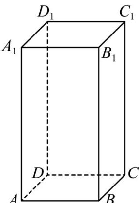

<!-- question-source:start -->
14．如图，正四棱柱 $ABCD-A_{1}B_{1}C_{1}D_{1}$ 中， $AA_{1}=2AB=2$ ，动点 P 满足 $AP=aAC+bAA_{1}$ ，且 $a,b\in(0,1)$ 。

则下列说法正确的是（）

A．当 $a=\frac{1}{2}$ 时，三棱锥 $A-PBB_{1}$ 的体积为 $\frac{1}{3}$

B. 当 $a + b = 1$ 时， $PB + PB_{1}$ 的最小值为 $\sqrt{6}$

C. 若直线 $_{BP}$ 与 $_{BD}$ 所成角为 $\frac{\pi}{4}$ ，则动点 $_{P}$ 的轨迹长为 $\frac{\sqrt{2}}{2}\pi$

D. 当 $a + 2b = 1$ 时，三棱锥 $P - ABC$ 外接球半径的取值范围是 $\left[\frac{\sqrt{2}}{2}, \frac{\sqrt{6}}{2}\right)$
<!-- question-source:end -->

![[高中/课堂同步/题库/人教A版高中数学同步讲义(2026)/03_选择性必修第一册/期中专项训练+期中模拟卷/专题01 空间向量及其运算（八大题型）（高效培优期中专项训练）数学人教A版2019高二选择性必修第一册/专题01_空间向量及其运算_八大题型/questions/answers/Q00079089A1.md]]
