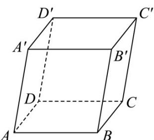

<!-- question-source:start -->
26. 已知平行六面体 $ABCD - A'B'C'D'$ ，化简下列向量表达式，并在图中标出化简得到的向量：

(1) $AB + AD + AA'$ ;

(2) $DD' - AB + BC$

(3) $AB + AD + \frac{1}{2}\left(DD' - BC\right).$
<!-- question-source:end -->

![[高中/课堂同步/题库/人教A版高中数学同步讲义(2026)/03_选择性必修第一册/期中专项训练+期中模拟卷/专题01 空间向量及其运算（八大题型）（高效培优期中专项训练）数学人教A版2019高二选择性必修第一册/专题01_空间向量及其运算_八大题型/questions/answers/Q00079099A1.md]]
