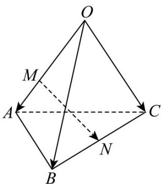

<!-- question-source:start -->
27. 如图，三棱锥 $O - ABC$ 中， $\overline{OA} = a$ ， $\overline{OB} = b$ ， $\overline{OC} = c$ ，且 $\overline{OM} = \frac{3}{4}\overline{OA}$ ， $\overline{CN} = \frac{1}{2}\overline{CB}$ ，则 $\overline{MN} = (\quad)$

A. $-\frac{1}{4}a + \frac{1}{3}b + \frac{1}{3}c$

C. $-\frac{3}{4}a + \frac{1}{2}b + \frac{1}{2}c$

B. $\frac{1}{4} a + \frac{1}{3} b + \frac{1}{3} c$

D. $\frac{3}{4} a + \frac{1}{2} b + \frac{1}{2} c$
<!-- question-source:end -->

![[高中/课堂同步/题库/人教A版高中数学同步讲义(2026)/03_选择性必修第一册/期中专项训练+期中模拟卷/专题01 空间向量及其运算（八大题型）（高效培优期中专项训练）数学人教A版2019高二选择性必修第一册/专题01_空间向量及其运算_八大题型/questions/answers/Q00079100A1.md]]
