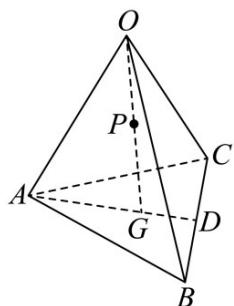

<!-- question-source:start -->
29. 如图，在四面体 $OABC$ 中， $D$ 为 $BC$ 的中点， $3AG = 2AD$ ，且 $P$ 为 $OG$ 的中点，则 $OP = (\quad)$

A. $\frac{1}{6}OA+\frac{1}{6}OB+\frac{1}{6}OC$

$$
- \frac {1}{6} O A + \frac {5}{6} O B + \frac {1}{6} O C
$$

C. $\frac{1}{3} OA + \frac{2}{3} OB - \frac{1}{6} OC$ D

$$
\frac {2}{3} \text {   OA   } - \frac {1}{6} \text {   OB   } + \frac {1}{3} \text {   OC   }
$$
<!-- question-source:end -->

![[高中/课堂同步/题库/人教A版高中数学同步讲义(2026)/03_选择性必修第一册/期中专项训练+期中模拟卷/专题01 空间向量及其运算（八大题型）（高效培优期中专项训练）数学人教A版2019高二选择性必修第一册/专题01_空间向量及其运算_八大题型/questions/answers/Q00079102A1.md]]
