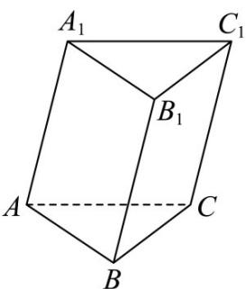

<!-- question-source:start -->
30．如图，三棱柱 $ABC-A_{1}B_{1}C_{1}$ 中， $AB=a$ ， $AC=b$ ， $AA_{1}=c$ ，点 M 为四边形 $BCC_{1}B_{1}$ 的中心点，则 $AM = (\quad)$

A. $\frac{1}{2} a + \frac{1}{2} b + \frac{1}{2} c$

C. $\frac{1}{2} a + \frac{1}{2} b - \frac{1}{2} c$

B. $a + \frac{1}{2}b + \frac{1}{2}c$

D. $a - \frac{1}{2}b - \frac{1}{2}c$
<!-- question-source:end -->

![[高中/课堂同步/题库/人教A版高中数学同步讲义(2026)/03_选择性必修第一册/期中专项训练+期中模拟卷/专题01 空间向量及其运算（八大题型）（高效培优期中专项训练）数学人教A版2019高二选择性必修第一册/专题01_空间向量及其运算_八大题型/questions/answers/Q00079103A1.md]]
