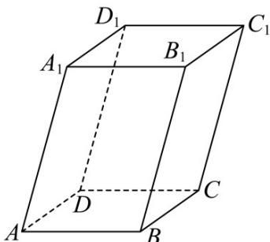

<!-- question-source:start -->
33. 如图，已知平行六面体 $ABCD - A_1B_1C_1D_1$ 中，底面 $ABCD$ 是边长为 1 的正方形， $AA_1 = 2, \angle A_1AB = \angle A_1AD = 60^\circ$ ，设 $AB = a, AD = b, AA_1 = c$ .

(1)用 a, b, c 表示 $AC_{1}$ ，并求 $\left|AC_{1}\right|$ ;

(2)求 $\cos AA_1, BD$
<!-- question-source:end -->

![[高中/课堂同步/题库/人教A版高中数学同步讲义(2026)/03_选择性必修第一册/期中专项训练+期中模拟卷/专题01 空间向量及其运算（八大题型）（高效培优期中专项训练）数学人教A版2019高二选择性必修第一册/专题01_空间向量及其运算_八大题型/questions/answers/Q00079106A1.md]]
