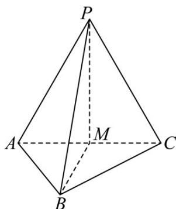

<!-- question-source:start -->
39. 如图，在三棱锥 $P - ABC$ 中， $PA = AC = PC = AB = a$ ， $PA \perp AB$ ， $AC \perp AB$ ， $M$ 为 $AC$ 中点·

(1)求证： $PM \perp$ 平面 ABC，并求直线 PB 和平面 ABC 所成角的正切值；

(2)设点 G 是 $\triangle PBC$ 的重心，用向量 $\stackrel{\cup\cup\cup}{AP}$ 、 $\stackrel{\cup\cup\cup}{AB}$ 、 $\stackrel{\cup\cup\cup}{AC}$ 表示 $\stackrel{\cup\cup\cup}{AG}$ ，并求点 A 到点 G 的距离.
<!-- question-source:end -->

![[高中/课堂同步/题库/人教A版高中数学同步讲义(2026)/03_选择性必修第一册/期中专项训练+期中模拟卷/专题01 空间向量及其运算（八大题型）（高效培优期中专项训练）数学人教A版2019高二选择性必修第一册/专题01_空间向量及其运算_八大题型/questions/answers/Q00079112A1.md]]
