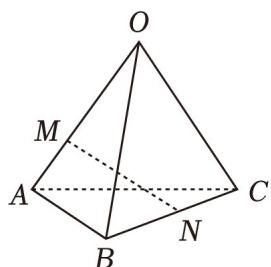

> [!faq]- 《专题01 空间向量及其运算（八大题型）（高效培优期中专项训练）数学人教A版2019高二选择性必修第一册》官方解析
>
> > [!success]- **【答案】**  A. $\frac{1}{2} a + \frac{1}{2} b - \frac{1}{2} c$ B. $-\frac{2}{3}a + \frac{1}{2}b + \frac{1}{2}c$ C. $\frac{2}{3} a + \frac{2}{3} b - \frac{1}{2} c$
>
> > [!note]- **【分析】**
> > 由空间向量的线性运算进行求解即可.
>
> > [!note]- **【解析】**
> > $MN = MA + AN = \frac{1}{3} OA + \frac{1}{2}(AB + AC) = \frac{1}{3} OA + \frac{1}{2}(OB - OA) + \frac{1}{2}(OC - OA)$ $= -\frac{2}{3} OA + \frac{1}{2} OB + \frac{1}{2} OC = -\frac{2}{3} a + \frac{1}{2} b + \frac{1}{2} c.$
> >
> > 故选 **B**
