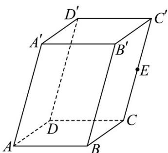

> [!faq]- 《专题01 空间向量及其运算（八大题型）（高效培优期中专项训练）数学人教A版2019高二选择性必修第一册》官方解析
>
> > [!success]- **【答案】**  A. $AB + AD = AC$ B. $AB - AA' = BA'$ C. $AB + AD + AA' = AC'$ D. $AB + BC + \frac{1}{2} CC' = AE$
>
> > [!note]- **【分析】**
> > 由空间向量的线性运算进行求解即可.
>
> > [!note]- **【解析】**
> > 对于 A，∵ 四边形 ABCD 是平行四边形，∴ $AB + AD = AC$ ，A 正确；
> >
> > 对于 B， $AB - AA' = A'B = -BA'$ ，B 错误；
> >
> > 对于 C， $AB + AD + AA' = AC + AA' = AC'$ ，C 正确；
> >
> > 对于 D， $AB + BC + \frac{1}{2} CC' = AC + CE = AE$ ，D 正确。
> >
> > 故选 **ACD**。
