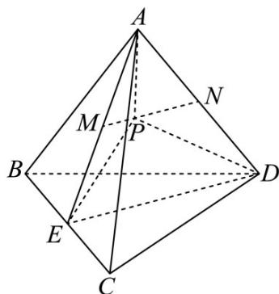

> [!faq]- 《专题01 空间向量及其运算（八大题型）（高效培优期中专项训练）数学人教A版2019高二选择性必修第一册》官方解析
>
> > [!success]- **【答案】** 2
>
> > [!note]- **【分析】**
> > 利用向量的加法运算将 $3PA + PB + PC + PD = 0$ 转化为 $PN = -2PM$ ，从而找到 $P$ 在线段 $MN$ 上且靠近 M 的三等分点处，继而得到 A 到平面 BCD 的距离是 P 到平面 BCD 的距离的 $^{2}$ 倍，从而得到所求。
>
> > [!note]- **【解析】**
> > 设 E 是 BC 的中点，∵ $PB + PC = 2PE$ ，又∵ $3PA + PB + PC + PD = 0$ ，
> > ∴ $3PA + 2PE + PD = 0$ ，∴ $2PA + 2PE + PA + PD = 0$ ，∴ $2(PA + PE) + (PA + PD) = 0$ ，
> > 设 M 是 AE 的中点，N 是 AD 的中点，∵ $PA + PE = 2PM$ ， $PA + PD = 2PN$ ，
> > ∴ $4PM + 2PN = 0$ ，∴ PN = -2PM，∴ P 在线段 MN 上且靠近 M 的三等分点处，
> > 又线段 MN 为 $\triangle AED$ 的中位线，∴ MN // ED，
> > ∴ A 到平面 BCD 的距离是 P 到平面 BCD 的距离的 $^{2}$ 倍，∴ $V_{PBCD} = \frac{1}{2} V_{ABCD} = \frac{1}{2} \times 4 = 2$ .
> >
> > 故答案为：2
> >
> > 
