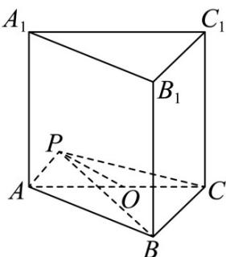

> [!faq]- 《专题01 空间向量及其运算（八大题型）（高效培优期中专项训练）数学人教A版2019高二选择性必修第一册》官方解析
>
> > [!success]- **【答案】** 4
>
> > [!note]- **【分析】**
> > 由 $PA + PC = mAB$ ，可得 $2PO = mAB \Rightarrow PO // AB$ ， $P$ 是 $\triangle ABC$ 所在平面内一点， $C$ 到直线 $AB$ 的距离等于 $P$ 到直线 $AB$ 的距离的 $^{2}$ 倍，进而可得到答案。
>
> > [!note]- **【解析】**
> > 取 AC 的中点 O，
> >
> > $$
> > \therefore P A + P C = m A B
> > $$
> >
> > $$
> > \therefore 2 P O = m A B \Rightarrow P O / / A B
> > $$
> >
> > ∴P 是 $\triangle ABC$ 所在平面内一点，C 到直线 AB 的距离等于 P 到直线 AB 的距离的 2 倍，
> >
> > 故 $S_{\triangle}ABC = 2S_{\triangle}ABP$ ，设三棱柱 $ABC - A_{1}B_{1}C_{1}$ 的高为 $h$
> >
> > 三棱锥 $A_{1} - ABP$ 的体积为 $\frac{1}{3}\times S_{\triangle PAB}\times h = \frac{1}{3}\times \frac{1}{2}\times S_{\triangle CAB}\times h = \frac{1}{6}\times S_{\triangle CAB}\times h$ $= \frac{1}{6} V_{ABC - A_1B_1C_1} = \frac{1}{6}\times 24 = 4$
> >
> > 故答案为：4.
> >
> > 
