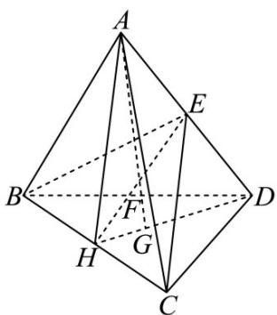

> [!faq]- 《专题01 空间向量及其运算（八大题型）（高效培优期中专项训练）数学人教A版2019高二选择性必修第一册》官方解析
>
> > [!success]- **【答案】** C
>
> > [!note]- **【分析】**
> > 根据共线定理及空间向量线性运算可得结果·
>
> > [!note]- **【解析】**
> > 如图：连接 DG 交 BC 于 H，则 H 为 BC 中点，连接 AH, EH, AG，
> > 因为 $AG \subset$ 平面 AHD ， $EH \subset$ 平面 AHD ，设 $AG \cap EH = K$ ，则 $K \in EH, K \in AG$ 又 $EH \subset$ 平面 BCE ，所以 $K \in$ 平面 BCE ，故 K 为 AG 与平面 BCE 的交点，
> > 又因为 AG 与平面 BCE 交于点 F ，所以 F 与 K 重合，
> >
> > 又 $E$ 为 $AD$ 的中点， $G$ 为平面 $BCD$ 的重心，
> >
> > 因为点 A, F, G 三点共线，则 $\overrightarrow{AF} = mAG = m\left(\overrightarrow{AD} + \overrightarrow{DG}\right) = m\left(\overrightarrow{AD} + \frac{2}{3}\overrightarrow{DH}\right)$ $= m\left(\overrightarrow{AD} + \frac{2}{3} \times \frac{\overrightarrow{DB} + \overrightarrow{DC}}{2}\right) = m\left[\overrightarrow{AD} + \frac{1}{3} \times \left(\overrightarrow{AB} - \overrightarrow{AD} + \overrightarrow{AC} - \overrightarrow{AD}\right)\right]$ $= \frac{1}{3} m\left(\overrightarrow{AD} + \overrightarrow{AB} + \overrightarrow{AC}\right)$ 又因为点 E, F, H 三点共线，则 $\overrightarrow{AF} = xAH + yAE, (x + y = 1)$ ， $AF = xAH + yAE = \frac{x}{2}\left(\overrightarrow{AB} + \overrightarrow{AC}\right) + \frac{y}{2}AD$
> >
> > 所以 $\left\{\begin{aligned}\frac{m}{3}&=\frac{x}{2}\\ x+y&=1\\ \frac{m}{3}&=\frac{y}{2}\end{aligned}\right.$ ，解得，即 $\frac{m}{3}=\frac{y}{2}$ $m=\frac{3}{4}$ $\frac{AF}{AF}=\frac{3}{4}AG$ ，故 $\frac{|AF|}{|AG|}=\frac{3}{4}$
> >
> > 故选：C.
> >
> > 
