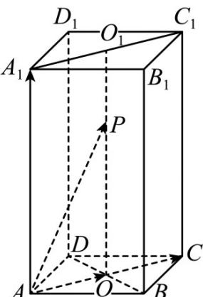
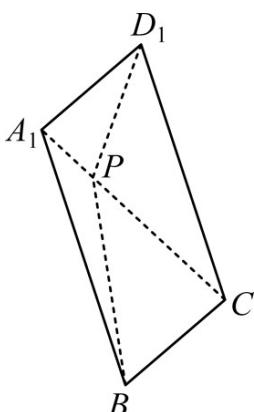
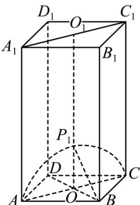
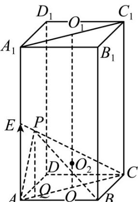

> [!faq]- 《专题01 空间向量及其运算（八大题型）（高效培优期中专项训练）数学人教A版2019高二选择性必修第一册》官方解析
>
> > [!success]- **【答案】** BCD
>
> > [!note]- **【分析】**
> > 当 $a = \frac{1}{2}$ 时，由平面向量线性运算法则可知点 $P$ 在线段 $OO_{1}$ 上，利用等体积法求出体积可判断 $\mathsf{A}$ 当 $a + b = 1$ 时，由共线定理可得点 $P$ 在线段 $CA_{1}$ 上，根据对称性将 $PB + PB_{1}$ 的最值转化成平面几何问题，即可求得最小值；若直线 $BP$ 与 $BD$ 所成角为 $\frac{\pi}{4}$ ，可知点 $P$ 的轨迹是以 $O$ 为圆心，半径为 $r = \frac{\sqrt{2}}{2}$ 的半圆弧，即可计算出其轨迹长度；当 $a + 2b = 1$ 时，取 $AA_{1}$ 的中点为 $E$ ，由共线定理可知 $P, C, E$ 三点共线，利用几何法即可找出球心位置，进而写出半径的表达式，利用二次函数的性质求出半径的取值范围·【详解】对于 $\mathsf{A}$ ，取 $AC, BD$ 相交于点 $O, A_{1}C_{1}$ 的中点为 $O_{1}$ ，如下图所示：
>
> > [!note]- **【解析】**
> > 
> > 当 $a = \frac{1}{2}$ 时，即 $\overline{AP} = \frac{1}{2}\overline{AC} + bAA_{1} = AO + bOO_{1}, b \in (0,1)$ ，
> > 由平面向量线性运算法则可知，点 P 在线段 $OO_{1}$ 上，又 $S_{\triangle BB_{1}A}=1$ ，
> > $\therefore V_{A-PBB_1} = V_{P-ABB_1} = \frac{1}{3} S_{\triangle ABB_1}\cdot \frac{1}{2} BC = \frac{1}{3}\times 1\times \frac{1}{2} = \frac{1}{6}$ 即 $^{\mathrm{A}}$ 不正确；
> > 对于 B，当 $a + b = 1$ 时，由 $AP = aAC + bAA_{1}$ ，利用共线定理可得， $P, C, A_{1}$ 三点共线，即点 P 在线段 $CA_{1}$ 上；
> > 由对称性可知，线段 $CA_{1}$ 上的点到 $D_{1}, B_{1}$ 两点之间的距离相等，所以 $PB + PB_{1} = PB + PD_{1}$ ;
> > 取平面 $A_{1}BCD_{1}$ 进行平面距离分析，如下图所示：
> > 
> > 所以 $PB + PD_{1}$ $BD_{1} = \sqrt{2^{2} + 1^{2} + 1^{2}} = \sqrt{6}$ ，当且仅当 $P, B, D_{1}$ 三点共线时，等号成立，
> > 此时点 $P$ 为线段 $CA_{1}$ 的中点，即 $PB + PB_{1}$ 的最小值为 $\sqrt{6}$ ，故 ${}^{\mathrm{B}}$ 正确；
> > 对于 $^{C}$ ，由图可知，BA,BC与BD所成角都为 $\frac{\pi}{4}$ ，由 $\overline{AP}=a\overline{AC}+b\overline{AA}_{1}$ 可知，点P在平面 $A_{1}ACC_{1}$ 内，
> > 若直线 $BP$ 与 $BD$ 所成角为 $\frac{\pi}{4}$ ，在线段 $OO_{1}$ 上取点 $P_{1}$ ，使 $OP_{1} = OB$ ，则直线 $BP_{1}$ 与 $BD$ 所成角为 $\frac{\pi}{4}$ ；
> > 则点 $P$ 的轨迹是以 $O$ 为圆心，半径为 $r = \frac{\sqrt{2}}{2}$ ，且在平面 $A_{1}ACC_{1}$ 内的半圆弧 $AP_{1}C$ ，如下图所示：
> > 
> > 所以动点 $P$ 的轨迹长为 $\pi r = \frac{\sqrt{2}}{2}\pi$ ，故C正确；
> > 对于 D，当 $a + 2b = 1$ 时，取 $AA_{1}$ 的中点为 E，即 $AA_{1} = 2AE$ ；
> > 由 $AP = aAC + bAA_{1} = aAC + 2bAE$ 可知， $P, C, E$ 三点共线，即点 $P$ 在线段 $CE$ 上，如下图所示：
> > 
> > 易知三棱锥 P-ABC 外接球球心在直线 $OO_{1}$ 上，设球心为 $O_{2}, OO_{2} = h$ ；
> > 作 $PQ \perp AC$ 于点 $Q$ ，设 $PQ = x \in (0,1)$ ，易知 $AE = 1, AC = \sqrt{2}$
> > 因为 $PQ \parallel AE$ ，则 $\frac{PQ}{AE} = \frac{CQ}{AC}$ ，得 $CQ = \sqrt{2} x$ ，则 $OQ = \left|\sqrt{2} x - \frac{\sqrt{2}}{2}\right|$ 设外接球半径为 $\int_{R} R^{2} = h^{2} + \left( \frac{\sqrt{2}}{2} \right)^{2} = \left| \sqrt{2} x - \frac{\sqrt{2}}{2} \right|^{2} + (x - h)^{2}$ ，解得 $h = \left| \frac{3x - 2}{2} \right|$ ；
> > 所以 $R^{2}=\left(\frac{3x-2}{2}\right)^{2}+\frac{1}{2}=\frac{9x^{2}-12x+6}{4}$ ，
> > 由二次函数的性质可知，当 $x = \frac{2}{3}$ 时，半径最小为 $R = \frac{\sqrt{2}}{2}$ ；当 $x = 0$ 时，半径最大为 $R = \frac{\sqrt{6}}{2}$
> > 又 $x \in (0,1)$ ，所以半径的取值范围是 $\left[\frac{\sqrt{2}}{2}, \frac{\sqrt{6}}{2}\right)$ ，即 $^D$ 正确·
> >
> > 故选 **BCD**.
