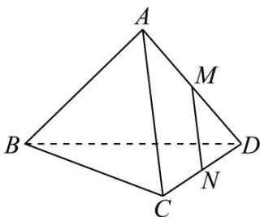
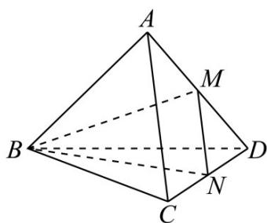

> [!faq]- 《专题01 空间向量及其运算（八大题型）（高效培优期中专项训练）数学人教A版2019高二选择性必修第一册》官方解析
>
> > [!success]- **【答案】**  A. CA B. AC C. NM D. MN
>
> > [!note]- **【分析】**
> > 由中点的向量公式与向量的减法运算即可得到答案·
>
> > [!note]- **【解析】**
> > 如图所示，连接 $BM, BN$ ，因为 $M, N$ 分别是棱 $AD, CD$ 的中点，所以 $\frac{1}{2}\left(BD + BA\right) - \frac{1}{2}\left(BD + BC\right) = BM - BN = NM.$
> >
> > 
> >
> > 故选：C.
> >
> > ## 考点 04 判定空间向量共面
> >
> > 16. 空间中，已知 $a$ 与 $b$ 不共线，那么“ $c$ 与 $a$ 、 $b$ 共面”的充分不必要条件是（）
> >
> > 【答案】
> > A．存在唯一一组实数 $\lambda$ 、 $\mu$ ，使得 $c = \lambda a + \mu b$ B． $c = a + b$ C．不存在实数 $\lambda$ 、 $\mu$ ，使得 $c = \lambda a + \mu b$ D． $c = 0$
> >
> > 【答案】BD
> >
> > 【分析】根据充分不必要条件的概念，以及向量共面的相关知识，然后依次分析每个选项与“c 与 a、b 共面”之间的条件关系·
> >
> > 【详解】根据向量基本定理，如果存在唯一一组实数 $\lambda$ 、 $\mu$ ，使得 $c = \lambda a + \mu b$ ，那么可以直接得出 $c$ 与 $a$ 、 $b$ 共面；
> >
> > 反之，若 $c$ 与 $a$ 、 $b$ 共面，也一定存在唯一一组实数 $\lambda$ 、 $\mu$ ，使得 $c = \lambda a + \mu b$
> >
> > 所以“存在唯一一组实数 $\lambda$ 、 $\mu$ ，使得 $c = \lambda a + \mu b$ ”是“c 与 a、b 共面”的充要条件，而不是充分不必要条件，故 A 选项不符合要求；
> >
> > 当 $c = a + b$ 时，显然 $c$ 可以由 $a$ 和 $b$ 线性表示，即 $c$ 与 $a$ 、 $b$ 共面，所以“ $c = a + b$ ”能推出“ $c$ 与 $a$ 、 $b$ 共面”；但是当 $c$ 与 $a$ 、 $b$ 共面时， $c$ 不一定就等于 $a + b$ ，还可能有其他的线性组合形式，所以“ $c = a + b$ ”是“ $c$ 与 $a$ 、 $b$ 共面”的充分不必要条件，故 ${}^{\mathrm{B}}$ 选项符合要求；
> >
> > “不存在实数 $\lambda$ 、 $\mu$ ，使得 $c = \lambda a + \mu b$ ”，这与“c 与 a、b 共面”是相互矛盾的关系，
> >
> > 即“不存在实数 $\lambda$ 、 $\mu$ ，使得 $c = \lambda a + \mu b$ ”能推出“c 与 a、b 不共面”，而不是“c 与 a、b 共面”，所以 C 选项不符合要求；
> >
> > 因为零向量与任意向量都共面，所以 c=0 时，c 与 a、b 共面，即“c=0”能推出“c 与 a、b 共面”；
> >
> > 反之，当 $c$ 与 $a$ 、 $b$ 共面时， $c$ 不一定为零向量，所以“ $c = 0$ ”是“ $c$ 与 $a$ 、 $b$ 共面”的充分不必要条件，故项符合要求：
> >
> > 故选 **BD**.
