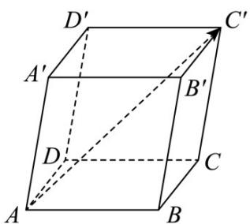
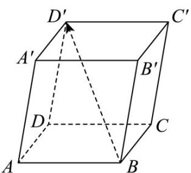
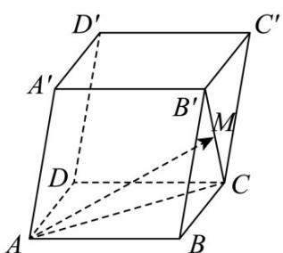

> [!faq]- 《专题01 空间向量及其运算（八大题型）（高效培优期中专项训练）数学人教A版2019高二选择性必修第一册》官方解析
>
> > [!success]- **【答案】** (1) $AC'$ ，作图见解析 (2) $BD'$ ，作图见解析 (3) AM，作图见解析
>
> > [!note]- **【分析】**
> > 根据空间向量的线性运算依次求解即可·
>
> > [!note]- **【解析】**
> > （1） $AB + AD + AA' = AB + BC + CC' = AC'$
> >
> > 向量 $AC'$ 如图所示.
> >
> > 
> >
> > (2) $DD' - AB + BC = DD' - (AB - AD) = DD' - DB = BD'$ ;
> >
> > 向量 $BD'$ 如图所示.
> >
> > 
> >
> > (3) $\overline{AB} + \overline{AD} + \frac{1}{2}\left(\overline{DD'} - \overline{BC}\right) = \overline{AC} + \frac{1}{2}\left(\overline{CC'} + \overline{CB}\right) = \overline{AC} + \frac{1}{2}\overline{CB'}$
> >
> > 设 $M$ 是线段 $CB'$ 的中点，
> >
> > 则 $AB + AD + \frac{1}{2}\left(DD' - BC\right) = AC + CM = AM$
> >
> > 向量 AM 如图所示·
> >
> > 
